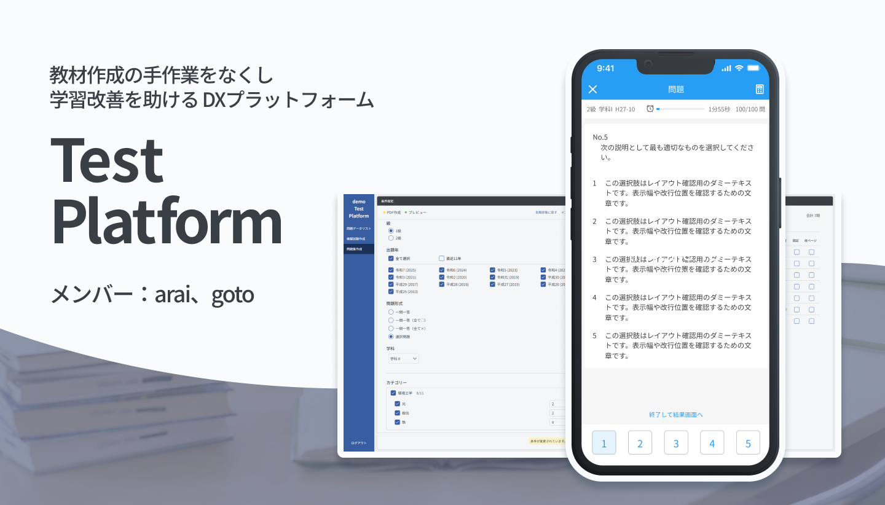
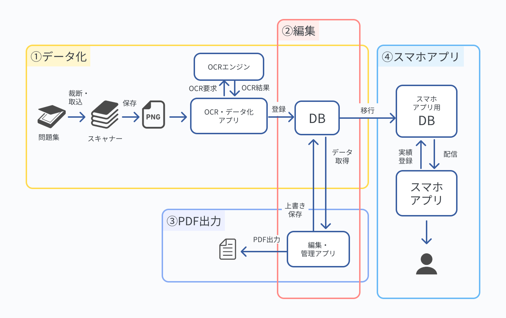
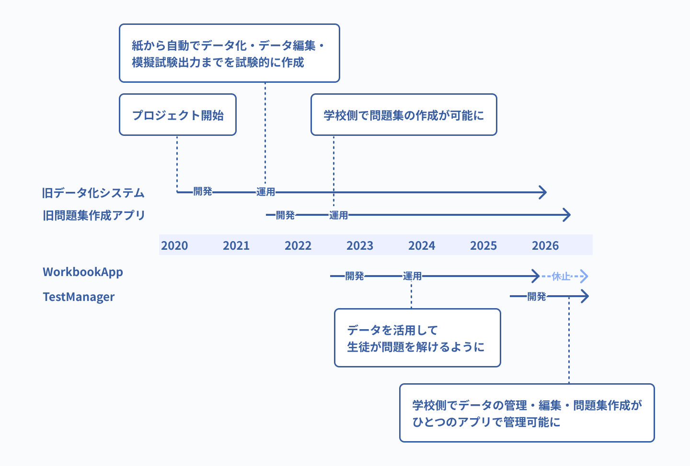
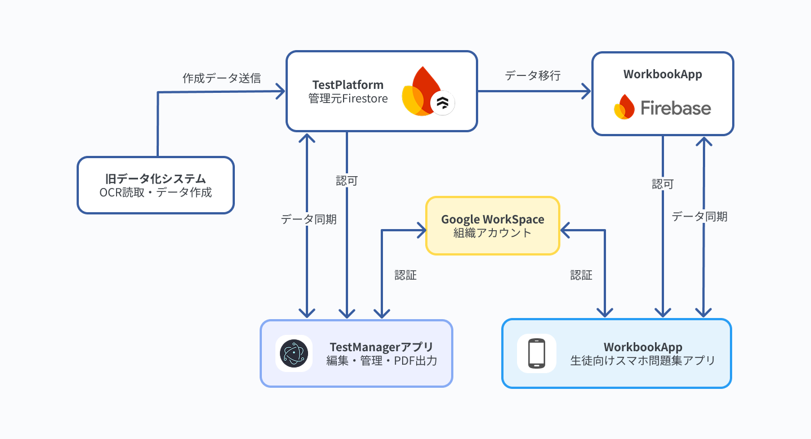
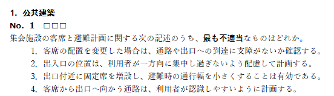
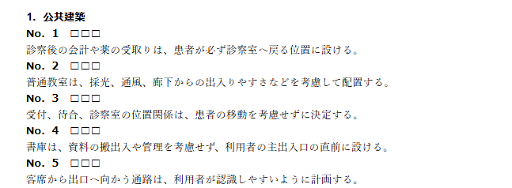
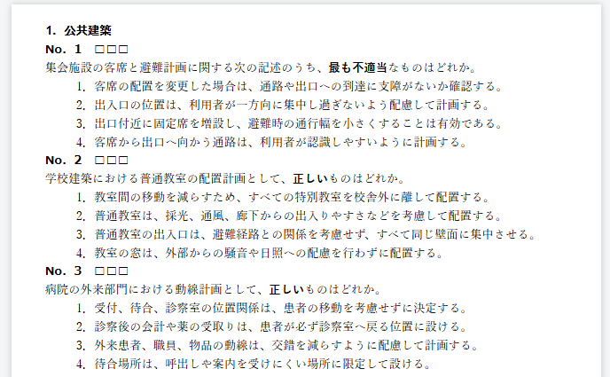
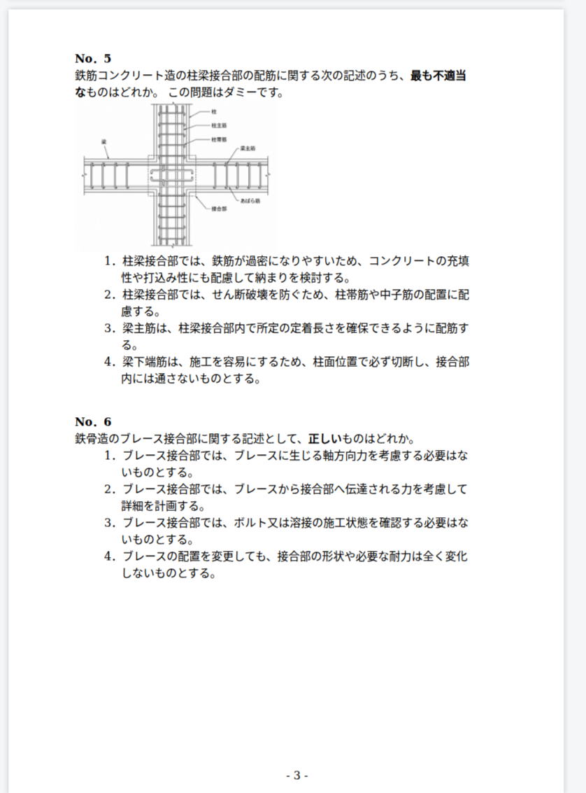

# 教材作成の手作業をなくし、学習改善を助けるDXプラットフォーム「TestPlatform」

 紙ベースの問題のデータ化から、問題データの管理、専用スマホ問題集アプリとの連携、問題集・模擬試験のPDF出力までを一貫して支援し、教材作成の省力化と学習内容の改善を後押しする総合システムです。 

  執筆者：arai

## TestPlatformとは 

このプロジェクトは、専門学校からの依頼により始まりました。当時、学校で使用されていた問題集や模擬試験は過去問を手作業で切り貼りして毎年作られていました。これらの作業は非常に手間がかかるうえに、学習記録をデータとして残しづらく、複雑な解析が難しい欠点がありました。

TestPlatformは、データ化により、これらの作業を省力化し、データをスマホアプリなどに活用したり、学習結果を解析することでよりよい学習プログラムを生徒に提供することを目的に作られました。

業務としては、① 紙の問題のデータ化 ② データ管理 ③ 問題集や模擬試験のPDF出力 ④ 生徒向けの出題と学習記録アプリの提供の4つをサポートしています。

本ポートフォリオでは、問題データの管理とPDF出力を担うTestManagerと、生徒向けのスマホアプリWorkbookAppを主に紹介しています。

## 開発背景

本プロジェクトでは、データ化システムそのものの概念構築からスタートし、そのシステムの活用と運用を学校側へ移していき、実際の業務に耐えられる形に落とし込んでいきました。

最初の旧データ化システムで、システムとしてはある程度形になった一方で、使用感やセキュリティ面の対策が学校側の業務に組み込むには不適で、データの管理も活用も業務レベルでは開発側で行うことになっていました。

そこで、まず学校側で問題集を作れるようにするために開発したのが旧問題集作成アプリでした。さらに、紙以外の問題データの活用先としてWorkbookAppを作成し、学校側が生徒の学習支援を行うようにしました。

こうして、学校側でデータの活用はできるようになった一方で、管理は開発側でしか行えない状態になっていました。そこで、データの管理も学校側で行えるようにすべくTestManagerを開発しました。

## プロダクト構成

| プロダクト       | 内容                              | プロダクト紹介                                | 担当ごとの紹介                                                                                                 | ソースコード                                                                                          |
| ----------- | ------------------------------- | -------------------------------------- | ------------------------------------------------------------------------------------------------------- | ----------------------------------------------------------------------------------------------- |
| TestManager | 校内で、問題データの編集・管理と、問題集・模擬試験のPDF出力 | [Product](apps/test-manager/README.md) | [arai](apps/test-manager/docs/contributors/arai.md)/[goto](apps/test-manager/docs/contributors/goto.md) | [クライアント](apps/test-manager/client)/[バックエンド](apps/test-manager/backend)                           |
| WorkbookApp | 生徒向けの出題と学習記録                    | [Product](apps/workbook-app/README.md) | [arai](apps/workbook-app/docs/contributors/arai.md)/[goto](apps/workbook-app/docs/contributors/goto.md) | [クライアント](apps/workbook-app/client)/[バックエンド](apps/workbook-app/backend)                           |
| 旧データ化システム   | 紙の問題を読み取り、問題データ化・編集・模擬試験出力を行う   | —                                      | —                                                                                                       | —                                                                                                 |
| 旧問題集作成アプリ   | 問題データから問題集・模擬試験のPDFを作る          | —                                      | —                                                                                                       | —                                                                                                 |

※ 旧データ化システムと旧問題集作成アプリは、本ポートフォリオの収録対象外になります。旧問題集作成アプリの役割と、旧データ化システムの一部機能は、TestManagerに引き継がれています
## 現行のアーキテクチャ

問題データはTestManager側のデータを管理元として扱っています。WorkbookAppは、データ構造が異なるため、管理元から専用の形式に変換したデータを使用しています。

共通の認証基盤としては、組織のGoogle Workspaceアカウントを使用しています。

各プロダクトの内部構成は、それぞれの[プロダクト紹介ページ](#プロダクト構成)で説明しています。

## 開発体制

本プロジェクトは、主にaraiとgotoの2名で開発を行いました。

| 名前   | 主な役割             |
| ---- | ---------------- |
| arai | プロジェクト主導・設計・基盤実装 |
| goto | デザイン・フロントエンド実装   |

- [araiのworkbookAppにおける実績](apps/workbook-app/docs/contributors/arai.md)
- [araiのtestManagerにおける実績](apps/test-manager/docs/contributors/arai.md)
- [gotoのworkbookAppにおける実績](apps/workbook-app/docs/contributors/goto.md)
- [gotoのtestManagerにおける実績](apps/test-manager/docs/contributors/goto.md)

## 用語

### 出題形式

- **選択式**：複数の選択肢から答えを選ぶ、実際の試験と同じ形式です
  

- **一問一答形式**：過去問の選択肢を1つずつ分解し、それぞれを正誤問題として出題する形式です。ユーザーは○✕で回答します。

### 出力物

- **問題集**：カテゴリ、問題数、難易度などを指定し、条件に合う問題を集めたものです

- **模擬試験**：カテゴリごとの出題枠に沿って構成した、実際の試験に近い形のものです

## 注意事項

- **公開は取引先の許可を得て行っています。** 
- **取引先を特定できる情報は記載していません。** 組織名、所在地、試験名などは伏せています。
- **収録しているデータはすべてダミーです。** 同梱の問題・解説データはAI生成によるもので、教材内容としての正確性は保証していません。利用者情報や学習履歴も架空のもので、実在の個人情報は含まれていません。
- **実際の試験問題は含まれていません。** 権利上公開できない問題文と画像は、公開版から除外しています。
- **ライセンスについて。** 本リポジトリは、OSSとして自由な利用を推奨するものではありません。無断での複製、再配布、商用利用は許可していません。詳細は[LICENSE](LICENSE)をご参照ください。

一部のシステムは公開対象に含めていません。収録範囲は[TestPlatformとは](#testplatformとは)に記載しています。
