# 問題データ管理システム「TestManager」

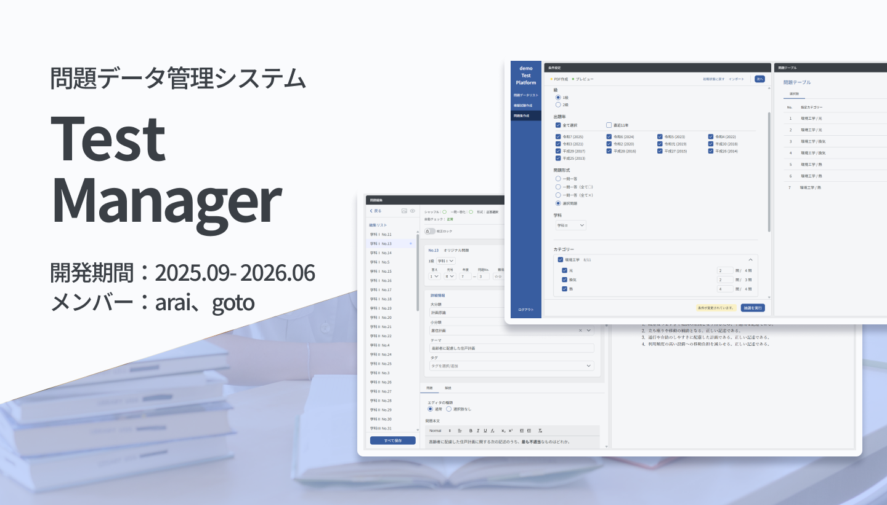

執筆者：arai

## 目次

- [概要](#概要)
- [期間](#期間)
- [開発経緯・目的](#開発経緯目的)
- [開発メンバー・担当範囲](#開発メンバー担当範囲)
- [開発方針・気をつけたこと](#開発方針気をつけたこと)
  - [業務要件の具体化](#業務要件の具体化)
  - [進捗・工数の可視化](#進捗工数の可視化)
  - [開発フローの改善](#開発フローの改善)
- [主な機能](#主な機能)
  - [問題データのリスト表示・ソート・フィルタリング](#問題データのリスト表示ソートフィルタリング)
  - [問題データ編集](#問題データ編集)
  - [画像アセットの管理](#画像アセットの管理)
  - [複数人での同時編集・リアルタイム同期](#複数人での同時編集リアルタイム同期)
  - [問題集・模擬試験PDFの出力](#問題集模擬試験pdfの出力)
  - [PDFレイアウトプレビュー](#pdfレイアウトプレビュー)
- [システム構成](#システム構成)
- [各種資料リンク](#各種資料リンク)
  - [関連ページ](#関連ページ)
  - [ソースコードとローカル起動](#ソースコードとローカル起動)

## 概要
TestManagerは、データ化した試験問題を、学校の講師自身が編集・管理し、問題集や模擬試験として出力できるようにした学内向けのWindowsデスクトップアプリです。

**講師が必要なときに問題データを直し、必要な形で出題できるようにするため**に、問題データの検索と編集、複数人での同時編集、出力レイアウトを確認しながらの問題集・模擬試験のPDF作成を行えるようにしました。

本システムで編集した問題データは、スマートフォン問題集アプリ「WorkbookApp」をはじめとする他システムでも利用されるデータの一次管理元としました。

※ 本ページ上で使われている問題・解説データは全てダミーです。内容の正しさは保証されていません。

## 期間
このTestManagerの開発期間
- **要件整理・提案**：2025年6月〜9月
- **開発**：2025年9月〜2026年6月
- **検収・検品**：2026年6月〜7月

2026年7月に納品完了し、依頼先の学校に業務用アプリとして導入・運用されています。

現在、当方では不具合が見つかった場合の対応や運用助言を行なっています。

## 開発経緯・目的
[本プロジェクト](../../README.md#開発背景)は、データ化から[スマホアプリ](../workbook-app/README.md)や問題集、模擬試験のPDF出力までの運用サイクルの確立まで出来ました。しかし、問題データの編集や管理は開発者しか触れない状態になっていました。システムの運用を取引先の校内でできるようにして、講師がデータを編集して利用できるようにしたいと取引先から要望がありました。

業務上の問題としても、問題データは法改正などにより陳腐化してしまう場合があり、この修正には専門知識が必要なため、私たちには出来ませんでした。

また模擬試験の発行も毎年、私たちに依頼して必要数を提出するような形になっており、学校側で自由に模擬試験を発行したいという要望もありました。

そこで、取引先の校内の講師が使用できる、問題データの編集・管理、模擬試験、模擬試験・問題集の発行までできる総合管理アプリを開発することになりました。

## 開発メンバー・担当範囲
本プロジェクトは2名で開発しました。

[前プロダクト](../workbook-app/README.md#開発メンバー担当範囲)よりgotoの担当範囲を広げ、UI関係の設計判断の一部も分担しています。

テストの作成と相互のPRレビューは、両者で担当しました。

| メンバー | 主な担当                                                                                            |
| ---- | ----------------------------------------------------------------------------------------------- |
| arai | 取引先との調整・要件整理、技術選定、全体設計、開発環境とCI/CDの構築、フロントエンド基盤、PDF生成とプレビュー描画ロジックの実装、バックエンド、タスク管理                |
| goto | 取引先との打ち合わせ参加・デザイン提案、UI/UXデザイン、UI関係のパッケージ調査・選定、画面構成と基本コンポーネントの設計、画面とコンポーネントの実装、一覧表示など画面機能のロジック実装 |

個別の設計判断や実装内容、より詳しい責任範囲については、それぞれのContributorページで説明しています。

- [araiのContributorページ](docs/contributors/arai.md)
- [gotoのContributorページ](docs/contributors/goto.md)

## 開発方針・気をつけたこと

運用も含めて取引先が実際に業務で使用するアプリだということを意識して、**取引先が業務に自然に組み込めるようにすること**を今回の方針として定めました。

### 業務要件の具体化
今回は、納品形式であるため、[前回のような](workbookApp product/#開発方針・気をつけたこと)改善フローを組む方法はとれませんでした。

そのため、要件や仕様の決定に労力をかけました。職場の見学を実際にさせていただいたり、講師にアンケートを実施する、複数回のヒアリングを実施するなどして業務要件と仕様を事前に固めました。

これによって、より実際の業務に沿った要件を提案することができました。

**メンバー個別の取り組み**
- [gotoの出したデザイン案](docs/contributors/goto.md)
- [araiが策定した要件](docs/contributors/arai.md#要件の整理提案)
### 進捗・工数の可視化
取引先から、「外から進捗が見えにくい」との指摘を受け、GitHub Projectsを導入して、残作業をバーンアップチャートで可視化しました。残作業を裏付けのある数値として出すために、工数をタスクごとに見積もりました。事前にプランニングポーカーのような方法を使い、作業者二人の工数感覚を組み入れられるようにしました。

これにより、月次の報告で残りのタスクと進み具合を共有できるようになり、遅れが出たときにも何が原因かを説明できるようになりました。

一方で、見積もりの精度を保つには定期的な棚卸しと実績の分析が必要でしたが、そこまでは手が回らず、厳密な指標としては機能しませんでした。

**メンバー個別の取り組み**
- [araiが行なった取引先への進捗報告の可視化施策](docs/contributors/arai.md#取引先への進捗報告の可視化)

### 開発フローの改善
[前回のworkbookApp](../workbook-app/README.md)では、メンバーによってコード品質にばらつきがあること、担当外のコードに関わらないためコード理解が浅くなるなどの問題点が提起されました。

そこで今回、チームとして開発フローの改善を行いました。以下はその一部を紹介いたします。

- 自動テストとPRレビューの導入
- 共通開発フロー(設計・実装・自己レビューサイクル)の策定 
- 共通開発フローをAI Skill・Agent化

これらにより、技術的課題や問題があった場合にも早い段階で洗い出しができるようになり、PRのたびに自動テストが行われるため、テストの実装及び保守が日常として組み込むことができました。

一方で、開発期間中のAIの進歩とメンバーのAIへの適応の結果でコードの実装量が上がっていき、レビューの負担が実装以上に重くなってしまいました。開発終盤ではレビューをスキップすることが増えたため、実装箇所の設計書を相互確認するといった開発フローも実験的に取り入れました。

## 主な機能
### 問題データのリスト表示・ソート・フィルタリング
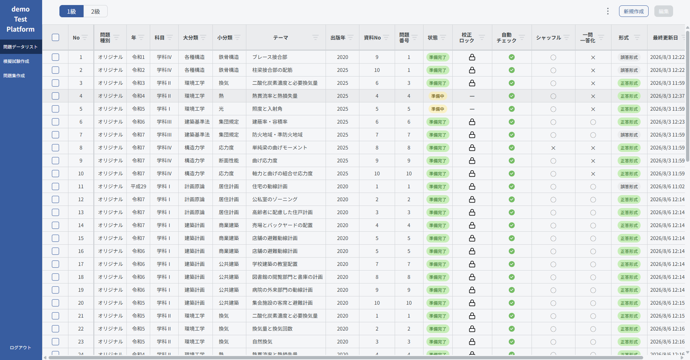
登録されている数千問の問題データをリスト形式で一覧表示することができます。講師はこれらをフィルタリングやソートすることで、必要なデータを俯瞰的に確認・選択して、すばやく編集することができます。

列の順番やレイアウトは講師自身で調整することもでき、この設定は他の画面に移動したりアプリを再起動しても保持されます。

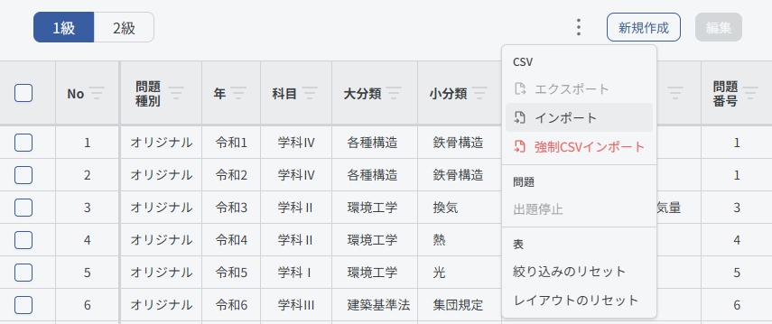

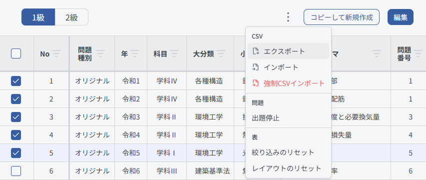

また、現在の問題データをCSV形式で出力したり、それを取り込むこともできます。

この機能を使うことで、問題データのバックアップを取ったり、講師がExcelでデータを閲覧・編集・分析して活用することができます。

### 問題データ編集
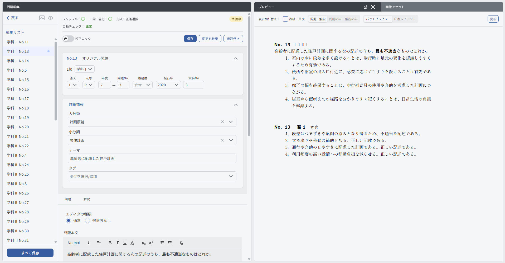
この機能は、講師が問題データを出題可能な形で自由に編集・作成できるようにするためのものです。

講師は、実際のレイアウトを確認しながら問題データを編集することができます。WordライクなUIで太字やイタリックなどの簡単な装飾をはじめ、数式(TeX)や画像の挿入も行えます。

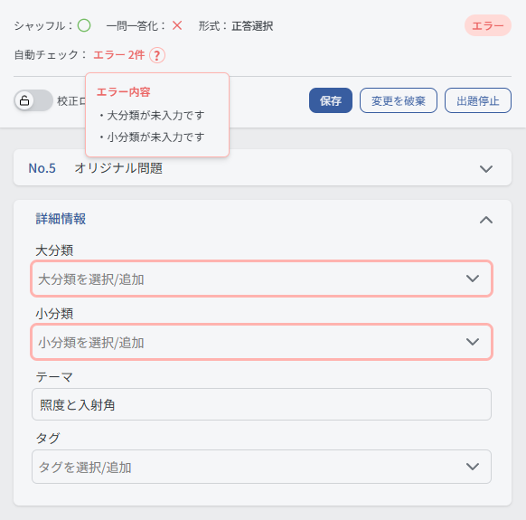

問題を出題できる状態にしたり、[一問一答形式](../../README.md#出題形式)として出題したりするには、満たすべき条件があります。この条件を編集画面で自動的にチェックし、講師がその場で過不足を確認できるようにしました。

問題データはまとめて選択して編集でき、一括での保存にも対応しています。リスト画面と編集画面を何度も往復しないで済むようにしています。

### 画像アセットの管理

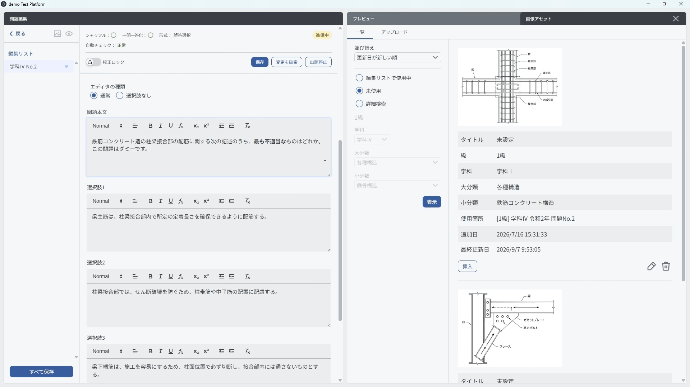

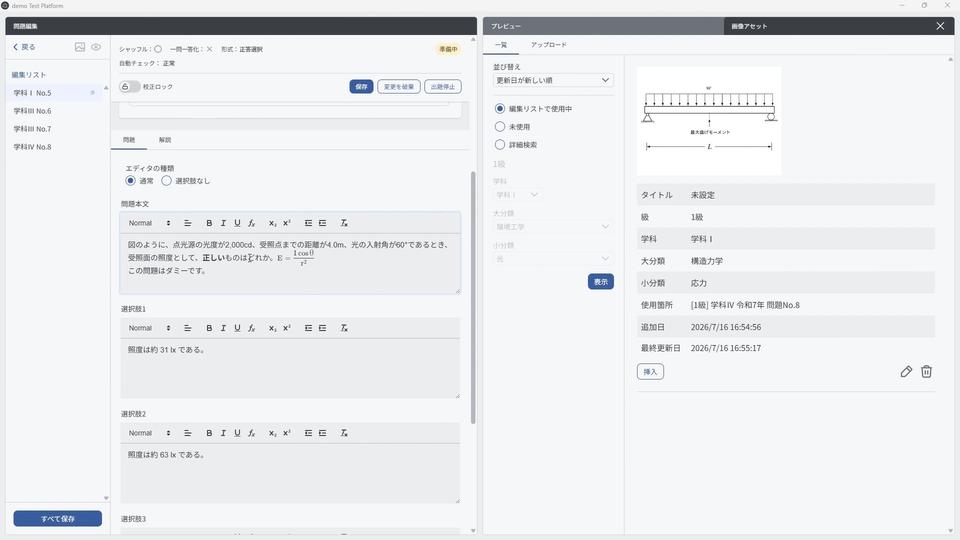
講師が、本システムで使われている数千枚の画像の中から効率的に特定の画像を見つけられるよう、フィルタリング・ソート機能を提供しています。

また、新規の画像をドラッグ&ドロップでアプリ上で簡単に新規登録することもできるようになっています。

### 複数人での同時編集・リアルタイム同期
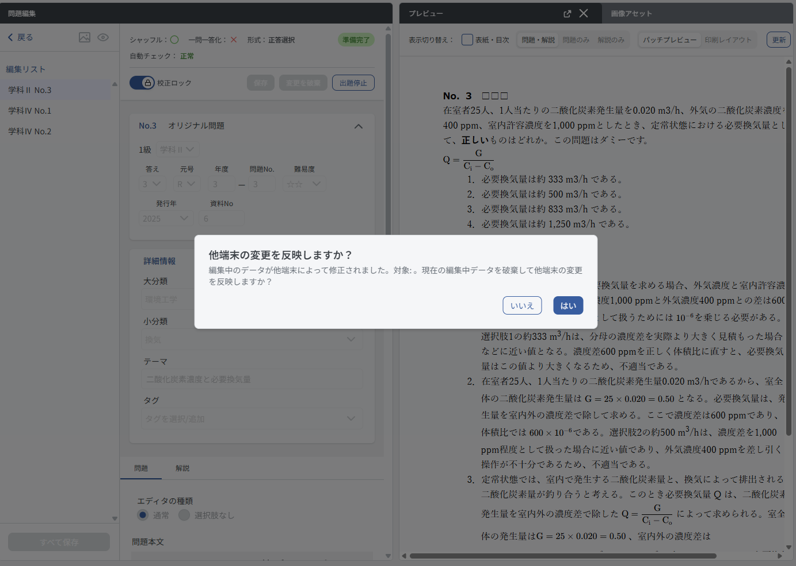

問題データの編集は、短い期間に集中して行う必要があり、複数人で分担することが前提になります。そのため本アプリは、端末間でデータをリアルタイムに同期する機能を備えています。

通常時は、バックグラウンドで自動的にサーバー上の変更を反映します。使用者は特別な操作をする必要はありません。

一方で、問題データ編集時に他の端末での変更が自動で反映されると、入力中の内容が失われるおそれがあります。そこで、もし他端末で編集問題の変更が行われた場合でも、アラートが出て講師が変更を反映するか、変更を反映しないで編集状態を保持するか選ぶことができるようにしています。

### 問題集・模擬試験PDFの出力

これまで問題集や模擬試験の発行は、必要になるたびに開発側へ依頼していただく必要がありました。この機能により、講師が必要なときに自分で作成することができるようになりました。

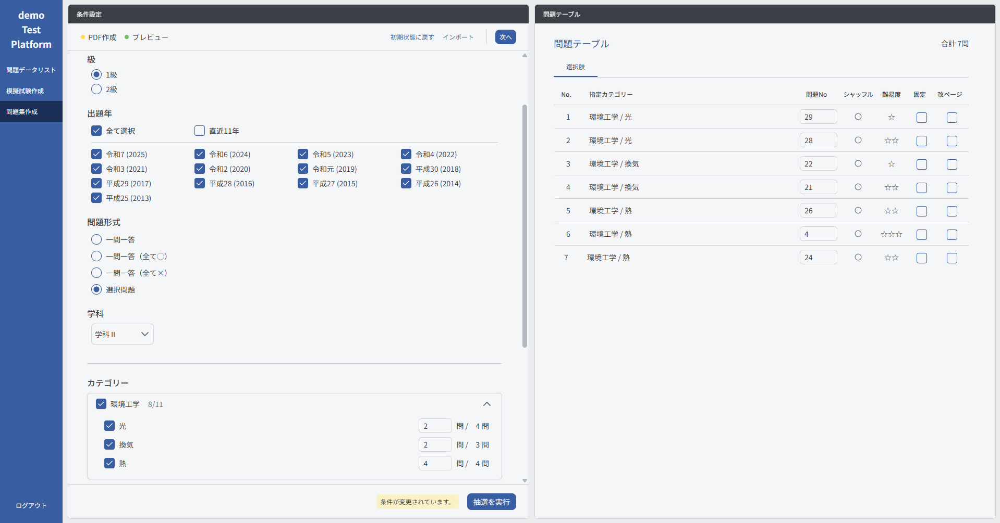

出題年、問題形式（選択肢・[一問一答](../../README.md#出題形式)）、難易度、カテゴリなどの条件を指定すると、条件に合う問題が抽選されて一覧に並びます。一覧の問題は個別に手動で差し替えられるので、プレビューで仕上がりを確認しながら調整できます。

調整した内容は、プレビューと同じレイアウトのままPDFとして出力されます。

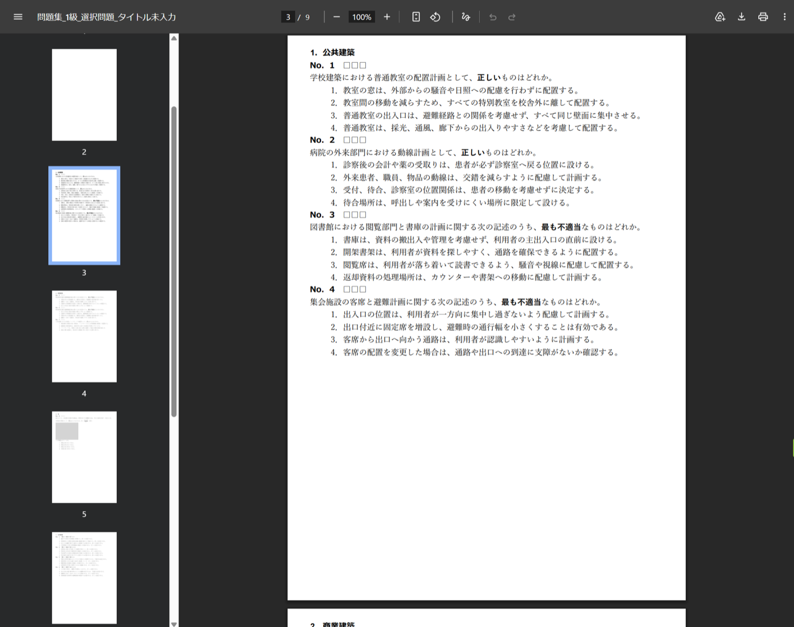

指定した条件と問題の一覧は、ファイルとして保存して読み込めます。よく使う設定を毎回作り直す必要はありません。

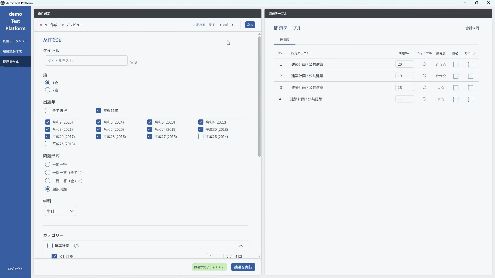

### PDFレイアウトプレビュー

[これまで](../../README.md#開発背景)の編集作業では、エディタ上では問題ないように見えてもPDFに出力すると用紙の制約などによりデザインが崩れる場合がありました。

そこで今回、編集画面やPDF出力画面では、実際にPDFでどのように問題が出力されるか確認できるプレビュー画面をあらたに開発しました。

実際の出力と同様の装飾、画像、数式表示がプレビュー上で再現されます。

また、紙のレイアウトを再現した印刷プレビューモードでは、文章の意味を損なわないような適切な位置で自動的に改ページを行います。これにより、出力後に不意に改ページが行われデザインが崩れるトラブルを軽減しました。

問題編集中は、軽快に変更が確認できることが必要です。この場面では、リアルタイムプレビューモードを印刷プレビューとは別に用意しています。

リアルタイムプレビューモードでは紙のレイアウトは再現されませんが、編集作業を邪魔せずに編集内容が即座に反映されるようになっています。

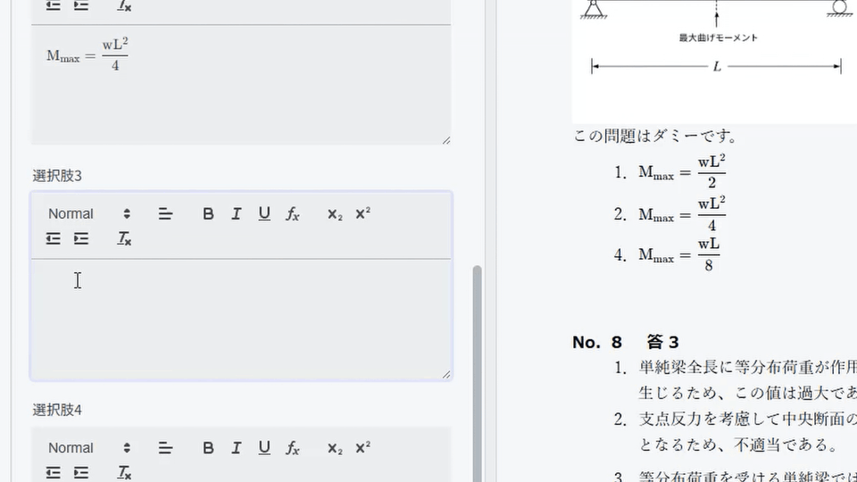

## システム構成
TestManagerは、講師の端末で動作するデスクトップアプリと、データを保持するクラウド基盤で構成されています。

- **クライアント**：Electron製のデスクトップアプリ。問題データと画像は端末内にキャッシュし、表示と編集に使います
- **バックエンド**：Firebase（Firestore／Cloud Storage／Cloud Functions）。問題データと画像アセットの保管、利用者への権限付与を担います
- **認証**：取引先組織のGoogle Workspaceアカウントを利用します
- **他システムとの接続**：編集した問題データは、WorkbookApp側のデータベースへ移行できます

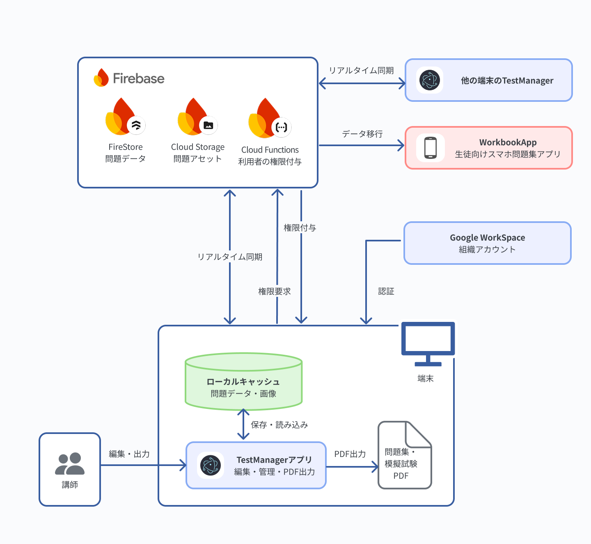

## 各種資料リンク
### 関連ページ

- [TestPlatformプロジェクトの説明](../../README.md)：TestPlatformプロジェクト全体の構成と、各プロダクトへ至る経緯
- [araiの担当・実績紹介](docs/contributors/arai.md)：araiのTestManagerにおける取り組みを紹介しています
- [gotoの担当・実績紹介](docs/contributors/goto.md)：gotoのTestManagerにおける取り組みを紹介しています

### ソースコードとローカル起動

- [クライアントのソースコード](client)：Electron、React、TypeScript
- [バックエンドのソースコード](backend)：Cloud Functions、Firestore／Storage Rules

※ ローカル起動環境は現在準備中です。
