# araiの担当・実績 | TestManager

執筆者：arai

## 目次

- [概要](#概要)
- [担当責務・責任境界](#担当責務責任境界)
- [開発の進め方](#開発の進め方)
  - [要件の整理・提案](#要件の整理提案)
  - [取引先への進捗報告の可視化](#取引先への進捗報告の可視化)
- [アーキテクチャ](#アーキテクチャ)
  - [全体設計](#全体設計)
  - [フロントエンド設計](#フロントエンド設計)
  - [バックエンド設計](#バックエンド設計)
- [主体的に解決した技術課題](#主体的に解決した技術課題)
  - [リアルタイムプレビュー・印刷プレビュー機能](#リアルタイムプレビュー印刷プレビュー機能)
  - [その他の技術的課題](#その他の技術的課題)
- [振り返り](#振り返り)
  - [よかった点](#よかった点)
  - [今後に活かしたい反省点](#今後に活かしたい反省点)
- [関連資料](#関連資料)
  - [関連ページ](#関連ページ)
  - [開発当時の資料](#開発当時の資料)
  - [ソースコードとローカル起動](#ソースコードとローカル起動)

## 概要
このページでは、問題データ管理システムTestManagerの開発において、araiが要件整理・全体設計・実装で実際に行った取り組みについて紹介します。

本ページではうまくいった判断だけでなく、そのときに受容した制約や反省点もあわせて書いています。

TestManagerアプリの詳細な説明に関しては、[こちら](../../README.md)の参照をお願いします。

## 担当責務・責任境界
| 領域             | 担当   | 内容                                                     | 責任境界                                                   |
| -------------- | ---- | ------------------------------------------------------ | ------------------------------------------------------ |
| 要件整理・取引先折衝     | 主担当  | 要件整理、ドキュメント作成、提案、会議参加、非機能要件の洗い出し、スコープ調整など              | デザインに関してはgotoが担当                                       |
| 全体設計           | 主担当  | 各レイヤーごとの責務分離、データフロー、ライフサイクルの決定、フレームワークの選定              | デザイン設計に関してはgotoが担当                                     |
| フロントエンド基盤設計・実装 | 主担当  | 状態管理方針の決定、メインプロセス/レンダープロセス責務の決定・IPC実装、データの責務や範囲の決定、型定義 | コンポーネント実装や設計レベル、一部の画面機能ロジックの実装はgotoが担当。決定の最終責任はaraiがもつ |
| バックエンド設計・実装    | 主担当  | データ設計・認証方式の決定及び実装・Functionsの実装、セキュリティルールの策定            | 設計から実装まで、ほぼaraiが単独で担当                                  |
| 技術的難所の設計・実装    | 主担当  | PDF生成・プレビュー描画ロジックの実装、メイン側ライフサイクルの実装                    | 表示部分に関してはgotoが大部分を担当                                   |
| タスク管理          | 主担当  | GitHub Projectsによるタスク設定および管理、取引先への進捗共有                 | 各担当の進捗判断に関してはそれぞれに一任                                   |
| CI/CDの構築       | 主担当  | CI/CDの設定、構築                                            | araiが単独で構築                                             |
| テスト・品質管理・レビュー  | 共同担当 | テスト基盤の設計、テストケース作成、PRレビュー、テスト実行                         | テストケースは各自で実装と同時に作成。テスト実行は各自およびCI/CD                    |

今回、gotoの裁量を[前プロダクト](../../../workbook-app/docs/contributors/arai.md#担当責務責任境界)より広げ、デザインだけでなくUI関係のパッケージ調査・導入や基本コンポーネントの構築、画面の基本構成などのフロントエンドの設計判断の一部も任せることにしました。この設計判断の最終的な責任はaraiが持つため、適宜、助言や修正の要求を行うことを事前に取り決めました。

ただし少人数開発のため、araiは担当範囲に縛られすぎず、上流工程だけでなく技術的難所や基盤実装、その他の機能部分など多くの部分で実装も担いました。

## 開発の進め方

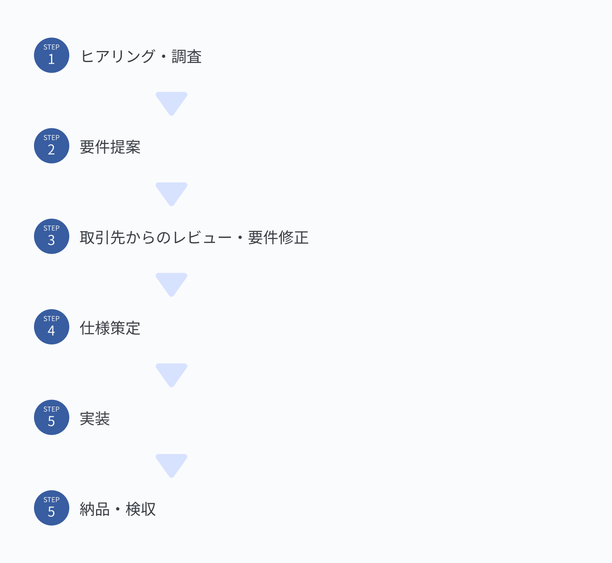

本プロダクトでは、これまで開発してきたシステムの運用を取引先へ移すことが目的のひとつでした。[前プロダクト](../../../workbook-app/docs/contributors/arai.md)までは運用と運用後の改善も私たちが担っていましたが、本プロダクトで担当するのは納品と、その後の不具合対応まででした。運用しながら仕様を調整していく前提が取れないため、要件と仕様を先に固めてから実装に入る進め方を採りました。

### 要件の整理・提案

仕様書の作成に先立ち、TestManagerを取引先で使用できるものにするために改めて現場の業務知識や環境を把握することからはじめました。

gotoと共同で取引先組織のメンバーへ事前アンケートを作成・実施し、作業現場を見学し、複数回にわたってヒアリングを行いました。

ここで得た情報は、仕様上の判断材料になりました。例えば、現場の業務用PCは基本的にシングルモニタで使われていたため、ウィンドウを細かく分けず、ひとつの画面内で作業が完結する構成を選びました。

また、実際に何人がどのように編集作業を行うかを把握するために、取引先の年間スケジュールや時期ごとの状況を詳しく聞きました。これにより具体的な使用時の要件を整理した上で、アプリが提供する機能のスコープを決めました。

> **策定した要件（一部）**
> 
> - 編集期間は、1.5ヶ月〜3ヶ月程度
> - 使用人数は、同時2〜4人程度
> - 複数人で編集作業をする可能性が高い
> - 法改正などの要因により、前年度以前のデータをあとから修正することがある

集めた内容をもとに、仕様書を作成・提案し、取引先と協議の上で修正する形で要件と仕様を固めました。

### 取引先への進捗報告の可視化
外からは進捗が見えにくいという問題点を取引先から指摘されました。この点は、[前プロダクト](../../../workbook-app/docs/contributors/arai.md#タスク管理と進捗共有)で、私たちも問題と思っていたこともあり、今回はGitHub Projectsでタスク管理を行うことにしました。

タスクの見積もりは、担当領域の作業量に責任を持ってもらい、araiだけの主観に寄らないようにするために、gotoとプランニングポーカー形式で行いました。二人ではプランニングポーカー本来の効果は限られますが、見積もりの場が作業量を互いに相談する機会になり、複数の角度から作業量を見積もれると考えて採用しました。設定したポイントは、バーンアップチャートで可視化しました。

これにより、月次報告時に残タスクやおおよその進捗が見えるようになり、遅れがあった場合の原因を明確にすることができました。

一方で、ポイント制によるタスク見積もりの精度を確保するには、定期的なタスクの棚卸しと実績の分析が必要でした。しかし、二人開発であったこともあって、そこまで手を回すことができず、あまり厳密な指標としては機能しませんでした。

今後は、事前にタスクごとに実際にかかったコストの集計を自動化するなどして、手間をかけずに続けられる仕組みを用意したいと考えています。

## アーキテクチャ

この章では、私が前回の経験や反省を踏まえて本プロダクトのアーキテクチャをこのように設計したか、その時に何を考えていたかの一部をご紹介いたします。

### 全体設計
今回のプロジェクトでは、過去の導入実績や要件からElectronでのWindows向けアプリとして開発することにしました。
#### 前提となる課題
設計にあたり、以下のような問題があると認識していました。
1. 本システムは、合計数千個の問題データと画像アセットを扱いました。特に画像アセットは、印刷用のため高解像度に設定していたため、容量も大きめでした。通信量を削減するために、できる限りキャッシュ活用する必要がありました。
2. 本アプリを導入予定のPCは性能的にはミドルエンドであり、他の複数のアプリを同時起動することも考えられました。また、Electron製アプリはマルチプロセスモデルを採用しているため、メモリやCPUを占有しやすいこともあり、ミドルエンドPCでも問題なく動くようなパフォーマンス性能は必要でした。
3. 問題編集作業は、1.5ヶ月〜3ヶ月の短期間で終わらせる必要があり、複数人での同時作業をすることがありました。そのため、編集状態は常に複数PC間で同期する必要がありました。しかし、web版Firestore SDKはスコープを絞り込んで監視するのが難しいので、前述のキャッシュ活用を行いつつ、リアルタイム同期できる機能を独自に開発する必要がありました。

これらの問題の解決を前提に、全体設計を行いました。

#### データライフサイクルモデルの策定

まず、各構成要素の役割を明確にすることから始めました。可能な限りメインプロセス・レンダープロセスのメモリを占有せず、ローカルキャッシュを利用するため次のようなモデルを構築することにしました。

Firestore・メインプロセス・レンダープロセス・ローカルキャッシュには以下のような役割と方針をもたせました。

  - Firestore...全ユーザ共通のデータ基盤。データ正本
  - メインプロセス...Firestore・ローカルキャッシュ・レンダープロセスのI/Oを集中管理
  - レンダープロセス...メインプロセスにデータを必要なときに必要な分だけ要求・取得し、表示する。不要なデータは長く保持せず、破棄する
  - ローカルキャッシュ...Storage/Firestoreのデータの永続保管場所

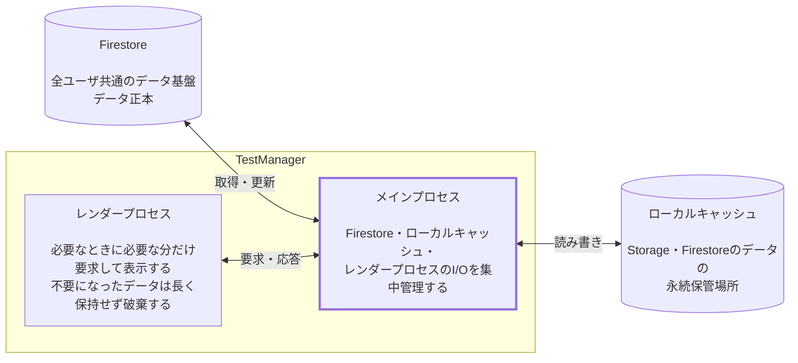

メインプロセスを各構成要素のハブとするような構成にして、レンダープロセスは直接のキャッシュ管理を行わないようにすることで、本来の役割であるアプリケーションレイヤの責務に集中する形にしました。

#### 問題データ・画像アセットのキャッシュ方法の検討
##### 方針
まず、方針として極力Firestoreデータはローカルに永続化し、画像アセットは実ファイルとして保存することにしました。

メインプロセスでのFirebase標準の永続化機能は、公式に保証されておらず、また永続化をアプリ側で制御できないことから、ローカルDBを別途導入する必要がありました。

選定の結果、今回はそれほど高度な機能は使わないこと、また高速なことからSQLiteを採用しました。

##### データフローの実装
以上の方針から、基本的なデータフローを以下のように定めました。

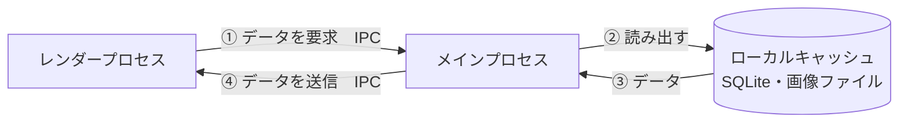

このデータフロー設計では、画像や問題データなどの静的なデータは必要な分だけをメモリに展開し、メモリ消費を抑えることを意図したものでした。

##### データフローの再設計

しかし、実装後に計測したところアプリのメモリ使用量が予想に反して増えてしまいました。状況によっては、アプリ単体で数GB以上占有してしまう場合がありました。

araiは、高画質・高容量の画像をメインからレンダープロセスへのIPC経由で繰り返し送受信したことで、シリアライズやプロセス間コピーによりメモリ負荷が増大してしまったことが原因ではないかと推測しました。

そこで、画像データの送受信に関してはIPC経路を通さず、専用スキームを配信してChroniumに取得させるような形にしました。

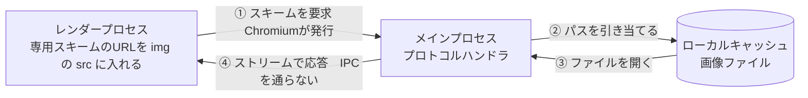

このようにデータフローに変更することで、IPC通信経路で大容量データをやり取りしないような形にしました。なお、ローカルファイルの読み込みには、HTTP通信と同様のキャッシュコントロールやストリーム配信を利用するために[Electronのカスタムプロトコル機能](https://www.electronjs.org/ja/docs/latest/api/protocol)を採用しました。
#### キャッシュインデックスによるデータ監視の採用

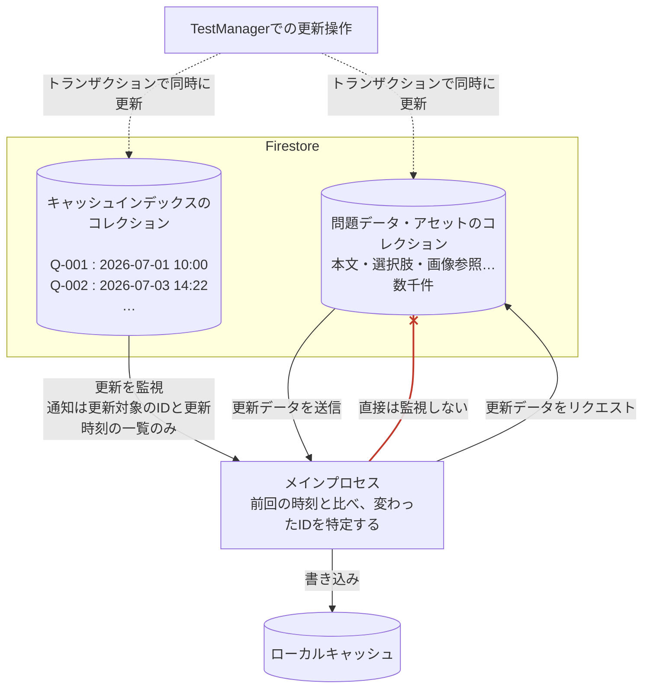

##### 背景・方針
[前述の通り](#前提となる課題)、web版Firestoreのリアルタイムリスナーでは、コレクションかドキュメント単位の変更検知しかできず、前者では変更検知のたびにコレクションを全て送ってしまい、後者ではドキュメントごとにリスナーを設置しなければいけなくなってしまいます。

そこで、データの新鮮度の管理を、Firestoreのリアルタイムリスナー機能に全て任せるのでなく、個々の問題データとアセットデータのドキュメントの更新時間を管理するキャッシュインデックスコレクション(以下、キャッシュインデックス)を別途Firestoreに作成することにしました。

このキャッシュインデックスは、問題データや画像アセットの追加・編集・削除時にトランザクション処理で同時に更新します。

メインプロセス側では、問題やアセットデータを直接監視せず、このキャッシュインデックスの更新状況のみを監視することで、更新時に取得する実データ数を削減しました。

その分、データ書き込み時にインデックスも同時更新する必要があり、トランザクション処理の導入などで複雑度が増してしまいました。

##### 施策の結果
これらの施策により、保守や実装の複雑性は増えたものの、数千個の問題データ・画像データを全量メモリに展開せずとも使用でき、当初に定めたメモリ使用量の要件を満たすことができました。複数のPC間でリアルタイムにデータ同期することができるシステムを構築しました。

施策の前後で、メモリ使用量を計測して比較しました。実際の操作の流れに沿って次の5段階で区切り、同じ環境・同じ入力データでそれぞれ3回ずつ測定しています。グラフの縦線は、その3回の幅です。

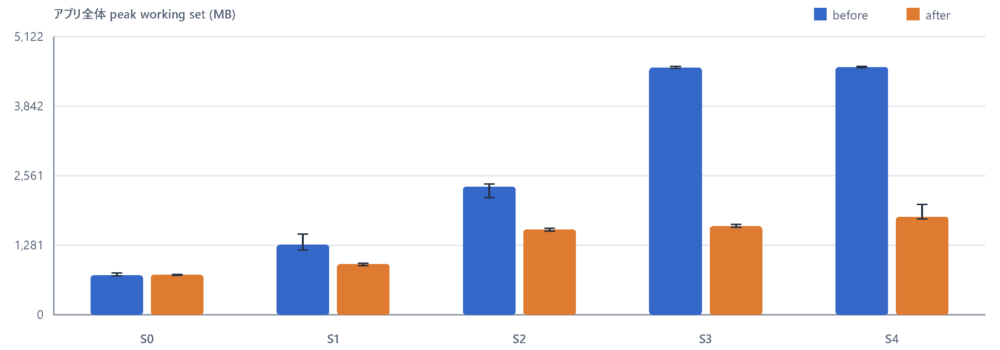

| 段階  | 計測した時点            |
| --- | ----------------- |
| S0  | 起動直後              |
| S1  | 固定した問題の編集画面を表示    |
| S2  | 模擬試験の初回プレビュー      |
| S3  | 再抽選とプレビュー更新を10回実行 |
| S4  | PDF出力             |

一方で、今回、設計段階で各プロセスへの負荷に目がいき、通信経路への配慮ができていませんでした。今後の開発ではIPC通信経路への負荷も初期から考慮材料に入れる必要があると感じました。

### フロントエンド設計
今回のプロジェクトでは、[前プロダクト](../../../workbook-app/docs/contributors/arai.md#見直しが必要な点)の経験や反省点を踏まえて、コンポーネントルールとともに状態管理についても設計段階から整理したうえで取り組みました。

#### 前プロダクトからの課題・背景
1. 前プロダクトでは、コンポーネントルールとしてAtomicDesignを実際の状況に合わせて改変して導入していました。ルールとしては機能していましたが、コンポーネント種類の判断コストがかかるという問題もあり、そのまま維持するか、変更するか改めて考える必要がありました。
2. 前プロダクトのスマートフォンアプリではView内・View間の状態の共有をContextで集中管理してしまったため、更新頻度の高いステートが上位Contextに入ってしまいました。その結果、依存により再描画が頻発し、保守性やパフォーマンスに難を抱えることになりました。本プロダクトでは、この解決を目指しました。
3. 今回のプロダクトは、データ編集・管理・問題集作成と複数の独立した役割をもつビューの複合プロジェクトです。そのため、各機能は同じデータリソース(問題・画像)を共有しつつもなるべく状態は独立するようにして、異なるView間で状態が混ざらないような設計を行うよう志向していました。
4. 基本的にアプリの再起動またはView間遷移したあとは、メモリを解放する方針にしたいと考えていました。表の設定(フィルタリングやソート)など、一部永続化して引き継ぎたいデータもあることから、これらを明示的に付与する仕組みが必要でした。

#### 状態管理の基本方針
まず、状態管理については方針を以下のように定めました。
  - View間の値の受け渡しは最小限にする
  - 状態ごとにもつ責務やスコープを明確にして、制限する
  - 明示的な永続化機能を持つ状態管理パッケージを使用する
  - 状態管理ストアの作成は、原則としてView層で行い、複数箇所で設置しないようにする
  - ルート層には、置くべき明確な理由がない限りストアやContextを設置しない

これにより、前回に課題となった最上位コンポーネントに責務が集中する問題や複雑な依存による再描画を抑えようと考えました。

#### コンポーネント階層ルールの再定義
コンポーネント階層ルールは、[前回の変則的なAtomicDesignルール](../../../workbook-app/docs/contributors/arai.md#独自のコンポーネント分類の策定)をそのまま使用しようと当初はgotoから提案をうけ、それをaraiが全体設計との整合性を確認してから承認する形で進めようとしていました。

しかし、デザインにDockViewによる分割ビューを採用することになり、このまま実装するとひとつの画面(View)に複数の分割画面(View)が内包される形になる恐れがありました。ルールの統一性が壊れてしまう恐れがあるため、この分割画面を扱うためのTemplate層をあらたに作ることにしました。

  - View
  - Template
  - Organisms
  - Parts
  - shadcnカスタムコンポーネント ※ 基底コンポーネント層

#### 技術選定
以上の方針を策定して、gotoにフロントエンドのパッケージについていくつか選定してもらいました。相談の上、最終的にはaraiが全体設計との整合を確認して、次のように決定しました。

- 基本構成：Electron+vite+TypeScript
-  画面遷移：react-router
- 状態管理：zustand
- 共通デザインシステム：shadcn
- 単体・結合テスト：vitest
- CSS：tailwind CSS

#### 結果
##### コンポーネントルールについて
今回のプロジェクトでは、コンポーネント分類の判断で議論になることがほとんどありませんでした。

一方で、今回の開発中に本格的に使用され始めたAIコーディングにおいてAIがルールを理解していない実装をすることがたびたびありました。これは、コーディングルールを明示的にしていなかったり、リンターで独自の設計ルールまで落とし込んで設定しなかったことが原因でした。

これらは開発終盤に顕在化しましたが、コストの問題で本プロダクトでは是正できませんでした。
##### 状態管理について
これらのルールを運用した結果、原則としてひとつのView内で使用するストアの生成箇所はView層に限られ、各ストアを参照するのはView配下だけになりました。これらのストアでは、意図せず複数のViewに跨いで責務を持つことがなくなり、View間の状態変化に起因する問題がほとんど起きませんでした。

一方で、useShallowのつけ忘れで過剰な再描画が発生するようなことがあり、レビュー段階で注意して確認する必要がありました。

なお、ストアの中には、全画面共通のローディング表示やグローバルメニューのように画面をまたいで参照するものもありました。これらは、複数Viewを跨いでひとつのインスタンスで管理する必要性があるため、無理に原則を適用せず、ルート層で生成することにしました。

永続化もzustandのpersistによって明示的に実装することができました。

スコープを制限しグローバルでの状態管理を行わなかった結果、再描画は抑えられ責務の分離は行えた一方でデータフローは複雑化しました。

問題データや画像などの複数のViewやTemplateで使用されるデータは、Viewごとに経路と同期方法を考える必要がありました。

メインプロセスとの同期は仕組みをhooksで導入することで共通化することができましたが、View以下でのデータフローは別個に設計する必要があり、この点はグローバルでの状態管理に比べると設計・実装コストは増大しました。

しかし、機能修正による影響がおおむねそのView内に収まっているため、開発期間中に前プロダクトで起きたような大規模なリファクタリングが必要になることはありませんでした。

増えたコストは一度払えば良い一方、責務の曖昧さによるコストは運用が長くなるほど積み上がっていきます。長く使われることを前提にするプロダクトである以上、一時のコストを支払っても運用にかかるコストは最小限にするのが良いと私は考えます。

### バックエンド設計
#### 背景
バックエンドの設計を行うにあたって、今回のプロダクトでは以下のような要件がありました。
  1. これまでのプロジェクトでデータの管理場所が、プロダクトごとにスプレッドシートやクラウドサービスなど、複数箇所に点在していました。データの正本を明確化し、他のシステムやアプリでも同じリソースを管理できるようにする必要がありました
  2. 原則として組織内の少人数の講師だけがシステムを使用可能にする必要があり、制御に関してはアプリ本体の漏えいリスクも考慮しなければなりませんでした
  3. 非同期通信を多用するため、誤更新などによるデータ不整合や意図しない大量の通信が発生する危険性が高く、[前回の経験](../../../workbook-app/docs/contributors/arai.md#見直しが必要な点)からSaaSへの影響を気にせず使用できるローカルテスト環境が必要と感じていました
  4. データの活用や業務フローの改善は今後も続けていく一方、ソフトウェアが乱立するようなことは避けるために、機能追加や拡張が行われる余地を残す必要がありました

#### 方針
要件をもとに、バックエンド全体の方針を次のように設定しました。
1. バックエンド基盤は原則としてひとつに統一して、これを正本として管理する
2. クライアントアプリだけでなく、バックエンドにも適切なアクセス制御をかける
3. 想定している同時使用人数や通信量は少ないため、データモデルに過度な最適化は行わず、また拡張しやすいようシンプルな設計にする
4. 可能な限り本番に近いローカルテスト環境を用意する

#### 施策
##### バックエンド基盤のFirebaseへの統一
バックエンド基盤は、今回新設するFirebaseプロジェクトを今後正本とすることに決め、他のデータベースは順次様子を見ながら廃止することにしました。

ただし、スマートフォンアプリのFirebaseデータベースに関しては、データ構造の違いがあり、そのままリプレースすることは難しいため維持し、本プロジェクトからスマートフォンアプリのデータベースへの移行経路を作成して対応しました。

##### 認証・認可
依頼主の組織には、専用のGoogle Workspaceが運用されており、所属するすべての講師・生徒に配布済みでした。アカウントからは講師・生徒の区別ができ、[前回のプロダクト](../../../workbook-app/docs/contributors/arai.md#認証と利用者別アクセス制御)でもすでに認証基盤として運用していました。今回もこれを認証基盤として活用することにしました。

権限の付与および認可は、初回ログイン時にクライアントからFunctionsに承認要求を送信する形式にしました。Functionsはアカウントの適格性をルールベースで判定して、それに応じてStorageやFirestoreへの閲覧・編集権限をカスタムクレームで付与しました。

そして、実際のRulesではこのカスタムクレームによってアクセス制御を行いました。

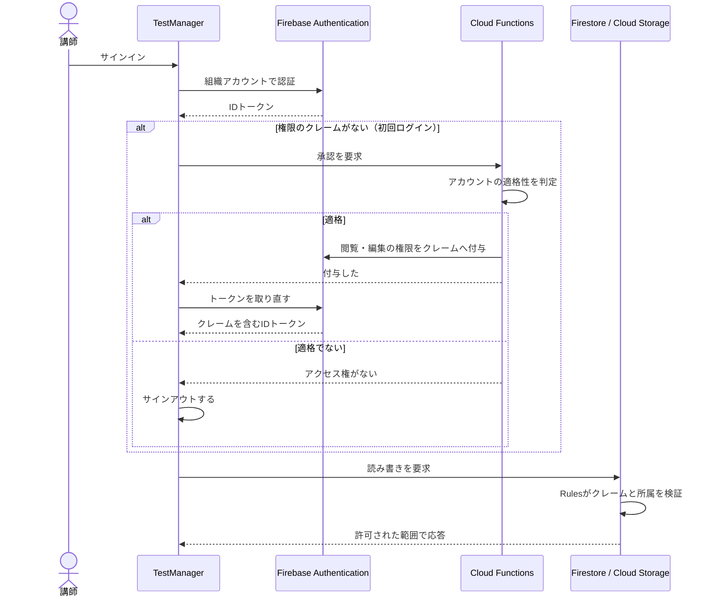

一律に特定アカウントを許可するより、今後バックエンド基盤に他のシステムから接続する場合にも個別に制御が効くように、閲覧・編集の権限を分けて付与することにしました。データの編集や更新はTestManagerに一本化する想定ですが、データの閲覧利用に関しては別のシステムで利用するユースケースは将来あると考えていました。

ただし、現時点では講師アカウントに一律で閲覧・編集権限を付与する形にしています。

##### 画像メタ情報の管理
Firebase Storageには、標準で直接クライアントが変更検知するような機能は提供されていません。そのため、Firestoreに作成時間や更新時間、画像のサイズ、形式、実際のStorage上のパスなどのリアルタイム同期に必要なメタ情報を別途管理するコレクションを作成しました。

なお、[前プロダクト](../../../workbook-app/docs/contributors/arai.md#バックエンド)ではこういったメタ情報の管理にRealtimeDatabaseを利用しましたが今回は利用人数が多くなく、利用目的別の最適化より保守対象のデータモデルをシンプルにする方がメリットが大きいと考え、Firestoreに統一しました。

##### キャッシュインデックス対応
フロントエンド開発の章で触れたように、キャッシュインデックスへの対応を行うか検討しました。Functionsを使用して、データ更新時に自動でキャッシュインデックスを更新する方向で考えていました。

しかし、Functionsでは書き込み失敗時の処理など複雑性が増すこと、データの更新経路がTestManagerに限定されており今後も経路が増える見込みはない点などを考慮して、クライアント側によるトランザクション処理で同時更新することにしました。

シンプルに実装できた一方で、将来別の更新経路が増える可能性を除外したため、もしそういったケースが発生した場合に更新処理が複雑化するリスクを負うことになりました。

##### ローカルエミュレータの利用
Firebase Local Emulatorを使用して、本番同様のローカル開発環境基盤を作りました。

データに関しては、本番データを使用できる形にダウンロードするスクリプトを別途作成して対応しました。

これで、本番環境への影響を気にせずテストすることができるようになりました。一方で、エミュレータの運用手順の確立が甘かったため、データの永続化処理に失敗して頻繁にデータが飛んだり、データ構造変更のたびに本番データの同期を何度もしなおさなければいけないなど運用面で課題が残りました。

同期やエミュレータ起動は途中でスクリプト化して1コマンドで済むようにしましたが、**それまでの期間は手作業の負担がそのまま残りました**。運用面も含めて初期から設計しておくべきだったと考えています。

#### 結果
今回、データリソースの正本を一本化でき、また適切にアクセス制御を行うことができました。ローカル開発環境の基盤も初期から構築したので、正本であるデータを汚染することなく開発することができ検証作業もしやすくなりました。

一方で、キャッシュインデックスなどの導入により、当初のシンプルな設計という方針に反して、設計やデータ規約が複雑化してしまいました。

機能の導入による複雑化が問題だったというより、データフローがブラックボックス化してしまい、管理しきれなくなる点に懸念があります。データ規約や処理の流れが可能な限り開発者の知識や技量に依存しない形で理解できるよう文書化や自動化を進めるのが重要だと感じています。

## 主体的に解決した技術課題
### リアルタイムプレビュー・印刷プレビュー機能

#### 背景
##### 本プロジェクトで利用している問題データ表現共通ロジック
本プロジェクトでは、問題・解説データをHTML上のDOM構造に流し込むことで表現しています。PDF化は、このDOM構造を[ElectronのprintToPDF()](https://www.electronjs.org/ja/docs/latest/api/web-contents#contentsprinttopdfoptions)を使い出力することで実現しています。

そのままだと問題や解説が使用にそぐわない位置で自動的に改ページしてしまうため、PDF化時には、制御された位置で改ページするようレイアウトを再調整したDOMをprintToPDF()に渡しています。

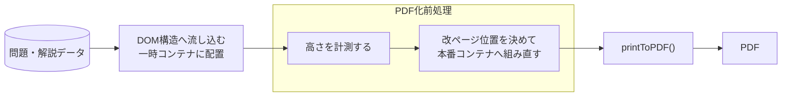

この一連のロジックは他のシステムでも導入できるようプラグイン化されており、本システムでも仕様の一貫性を保持するために改修した上で利用することが前提となっていました。

##### 共通ロジック導入に関する問題
[これまでは](../../../../README.md#開発背景)編集時にあらかじめ印刷状態をプレビューする機能はなく、編集者はエディタ内の表示状態でレイアウトを判断していました。

しかし、実際はエディタで問題ないように見えても、実際のPDFでは用紙の制約によりレイアウトが崩れている場合があり、編集作業の負担になっていました。

また、プラグインは数年前にJSで書かれ、リファクタリングする機会もなかったため、非常に修正のしづらいレガシーコードになっていました。

不具合もあり、改ページ判定が特殊なケースでうまくいかない場合がありました。

今までは私たち自身でうまくいかなかった場合は、手動で修正していましたが、今回は取引先に卸すため、より改ページの精度を高くする必要がありました。

#### 要件
そこで今回、誰でも使いやすい編集体験を満たすために、以下の要件を設定しました。
- データ表示プラグインは本プロダクトでも継続利用するが、TypeScriptでリファクタリングしたうえで導入する
- 改ページ判定の精度をあげ、基本的には出力PDFと同じレイアウトになるようにする
- プレビューにPDF印刷時と同様の紙のレイアウトを可能な限り再現して確認できるようにする
- 編集時に、プレビューで編集状態を常時確認できるようにする

#### 実装前に判明した課題
リファクタリングを進めていく過程で、このプラグインの基本設計では、紙のレイアウトを維持しながら一部だけレイアウトを変更するのは難しいということが判明しました。

一部の要素の高さが変更され、改ページ判定がずれると、後続の全ての問題のレイアウトの再判定を行わなければいけなくなり、その処理を作るコストは大きすぎると見られたからです。

そのため、折衷案として紙のレイアウトや改ページを忠実に再現する印刷プレビューとそれらの再現を行わないかわりに、編集内容を即座に反映するリアルタイムプレビューにモードを分離することにしました。

**印刷プレビュー**

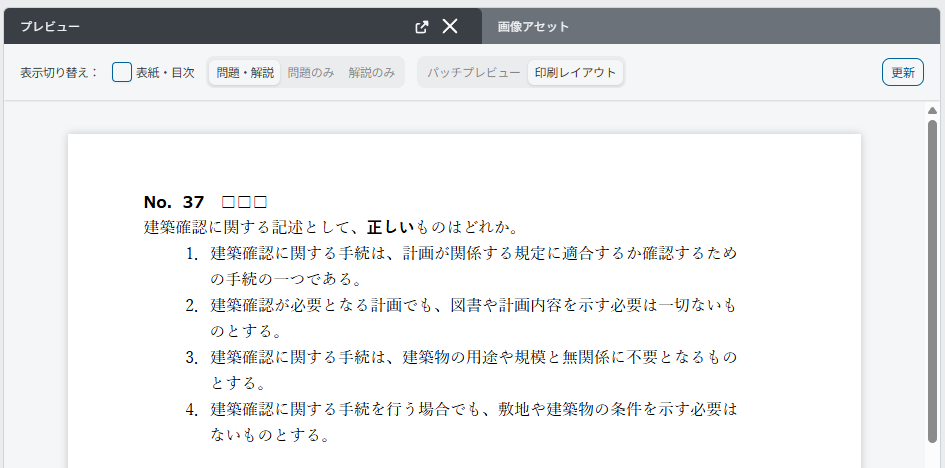

**リアルタイムプレビュー**

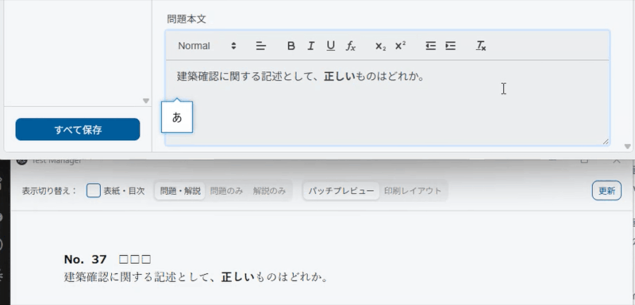

プレビュー表示時の共通仕様として、初回と手動更新時に必ず高さ計測を含むフルレンダリングを行い、プレビュー画面のDOM構成を作成します。

リアルタイムプレビュー時は、フルレンダリングで構築したDOM要素の構造は変えずに、編集のたびに編集内容だけを部分的に書き換えています。これにより高速な再レンダリングが行えるようになります。

| モード         | 特徴                          | 更新トリガー    | 用途             |
| ----------- | --------------------------- | --------- | -------------- |
| リアルタイムプレビュー | DOM構造は変えず内容だけ編集ごとに自動的に差し替える | 編集操作、手動更新 | 日常の編集確認        |
| 印刷プレビュー     | プレビュー更新は手動更新のみ              | 初回表示、手動更新 | PDF出力前のレイアウト確認 |

通常の編集作業中はリアルタイムプレビューを使用し、レイアウトの最終確認時などに印刷プレビューを使用して最終確認するような実務フローでの利用を想定しています。

#### フロート画像の高さ計測に関する困難
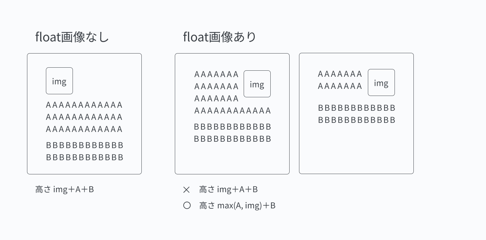

本プロダクトの問題データの表現方法の一つに、画像の回り込み(フロート画像)を採用していました。これが改ページがうまくいかない主要原因となっていました。フロート要素があると、他の要素が横に回り込むため、単純に親要素の高さを加算していくだけでは計算できません。そこでフロート画像の場合は、特別な計算経路を追加して、正確な高さ判定ができるようにしました。

しかし、この処理経路を追加したことで、フロート画像が続く場合や回り込みの起きなかったフロート画像があった場合などの特殊ケースに対応のための分岐処理が大量に増えてしまいました。

また、この特殊ケースの発生を事前想定し切ることができず、手動テストで不具合が発生した場合に都度対応するような形になってしまいました。

#### 結果
これらの機能改善の結果、編集中に実際のレイアウトを確認できるようになり、実装後に私たちで行なった編集作業において手戻りが減ることが体感できました。

またリファクタリングを行ったことで修正も容易になり、レガシーコードはある程度解消されました。

一方で、このシステムの「特殊なケースで改ページ判定に不具合が起こる場合がある」懸念は解消されきているとはいえませんでした。

未知のケースを事前に潰し切るのは難しいため、判明したケースはテストで固定するようにしました。今後は、レイアウトに関しても自動で崩れを検出できるような仕組みを入れたいと感じました。

### その他の技術的課題
それ以外にも本プロダクトでaraiが設計・実装担当した技術的課題について一部を紹介いたします。

| 機能     | 解決した課題                                                              | 担当内容                          |
| ------ | ------------------------------------------------------------------- | ----------------------------- |
| 問題抽選   | 難易度・カテゴリ・固定問題など複数条件を満たし、重複なく選ぶ必要があった。事前計算により、条件を満たせない場合を事前に軽量に割り出した | 条件調整を含む抽選ロジックと状態管理を設計・実装      |
| 一問一答変換 | 選択式問題からアプリ用データを手作業で作る負担があった                                         | 問題文・解説文としての体裁が保てる変換処理および判定を実装 |
| 自動チェック | 入力漏れや項目間の不整合を出力前に発見する必要があった                                         | ルール単位の検証処理と結果表示を設計・実装         |

## 振り返り
このプロダクトでは、[前プロダクト](../../../workbook-app/docs/contributors/arai.md#振り返り)で得た知見や反省点を活用して、責務の明確化と開発フローの改善を意識して行いました。

ある程度上手く行ったところもあれば、やはりまだまだ徹底しきれていないと感じる部分もありました。

### よかった点
今回の施策のうち、今後も意識して取り入れたいものをピックアップしました。

1. **責務とスコープを設計段階で明確にすること**
機能やコンポーネント、[データ構造の責務やスコープを可能な限り制限的に設計した](#データライフサイクルモデルの策定)結果、[今までに比べて改修がしやすく感じました](#状態管理について)。責務が明確になったため、仕様調整があっても迷わずに対応することができました。

2. **レビューを仕組みとして取り入れること**
今回、設計→実装→レビュー→再設計→...の開発サイクルをAIのSkillに組み込み、設計やレビューを飛ばして実装しないよう仕組み化しました。また、GitHub Actionsによる自動テストをPR時に組み込み、テストが正常に動いているか可視化されるようにしました。

これにより、開発フローに自然にレビュー工程やテスト工程を入れ込むことができ、より品質管理がしやすくなりました。一方で、コード規約の遵守という点では[問題](#今後に活かしたい反省点)も発生しました。

3. **実際の業務に沿った提案を行えるようにすること**
事前に[取引先の組織を見学したりアンケートなどを行い](#要件の整理提案)、ただ作るのでなく、より業務の実態にあった仕様を提案できるように努めました。

今後もひとりよがりにならず、なるべく実際に使用する人の視点に沿ったものづくりをしたいと考えています。

### 今後に活かしたい反省点
一方で、反省したい点もありました。これらは、今後の開発で改善していきたいです。

1. **タスク分割が抽象的すぎたこと**
個々のタスク分割が甘かったため、arai自身も含め次にどこをやればいいのかわからない場面が何回かありました。また、タスクが分割しきれていないため複数のタスクを同時に横断しなくてはならず、他のタスクの進行を待たないと完了までいくことができないこともありました。

今後は、タスク一覧を作るときは、分割可能ではないか、終了条件が明確か、そのタスク内で完結しているかに気をつけようと思います。

2. **コード規約に強制力を持たせられなかったこと**
今回、独自のコンポーネントルールを制定してチーム内のレビューなどによって一定の浸透はできていたと思います。しかし、[AIによるルール違反](#コンポーネントルールについて)を防止するためにも、リンターのカスタムルールで独自のコード規約を強制する仕組みを導入したり、レビュー用エージェントにコード規約の観点を明示的に加えるといった対策が必要と感じました。

3. **E2Eテストやパフォーマンステストを自動化できなかったこと**
今回、vitestによる単体テストや結合テストはかなり自動化できた一方で、E2Eテストやパフォーマンステストを自動化して行えませんでした。

E2Eテスト基盤として、Playwrightを初期から導入はしていましたが定着して使用することはできず、もっぱらAIによる画面操作用途になってしまいました。

少人数開発ということもあり、完全にテストを網羅するのは難しいところもあります。ただ、最低限でも作っておけば、結果的に手動テストの労力が削減できることは期待できるので今後は積極的に行っていきたいと思います。

## 関連資料

### 関連ページ

- [TestManagerプロダクト紹介](../../README.md)：プロダクトの目的、解決した業務課題、主な機能
- [TestManagerにおけるgotoの担当・実績](goto.md)：UI/UXデザインと画面およびコンポーネント実装の担当範囲
- [WorkbookAppにおけるaraiの担当・実績](../../../workbook-app/docs/contributors/arai.md)：本ページで前プロダクトとして参照している、araiの担当範囲と当時の課題
- [TestPlatformプロジェクトの説明](../../../../README.md)：TestPlatformプロジェクト全体の構成と、各プロダクトへ至る経緯
### 開発当時の資料

いずれも開発期間中に作成したものです。

- [Firestoreキャッシュ管理設計書](../designs/firestoreキャッシュ管理設計書.md)：[全体設計](#全体設計)で述べたキャッシュインデックスと同期の仕様
- [PDF作成モード DFD](../designs/PDF作成モード_DFD.md)：プレビューとPDF出力に関わるデータフロー
- [PDF出力設計](../designs/PDF作成_PDF出力設計.md)：[リアルタイムプレビュー・印刷プレビュー機能](#リアルタイムプレビュー印刷プレビュー機能)のレンダリングと改ページの設計
- [抽選ロジック設計書](../designs/PDF作成_抽選ロジック設計書_v2.md)：[その他の技術的課題](#その他の技術的課題)で挙げた問題抽選の条件判定
- [状態管理Hooksとzustandの責務仕様](../designs/PDF作成モード_hooks_zustand責務仕様書.html)：[フロントエンド設計](#フロントエンド設計)で述べたストアの配置と責務の分担

### ソースコードとローカル起動

- [クライアントのソースコード](../../client)：Electron、React、TypeScript
- [バックエンドのソースコード](../../backend)：Cloud Functions、Firestore／Storage Rules、運用スクリプト
※ リンクのパスと表示名は、公開時のリポジトリ構成に合わせて調整しています。
※ 実データ、取引先情報などは、除外またはダミーの表現に入れ替えた上で掲載しています
