# gotoの担当・実績 | TestManager

執筆者: goto

試験問題の管理、編集、問題集作成を行うデスクトップアプリ「TestManager」を、2名で共同開発しました。本ページでは、gotoが担当した領域と、UIデザインおよび画面実装で行った改善を紹介します。

## 目次

- [概要](#概要)
  - [システムの概要](#システムの概要)
  - [担当範囲](#担当範囲)
  - [使用ツール](#使用ツール)
- [課題と要件の整理](#課題と要件の整理)
  - [機能改善のアイデア出し](#機能改善のアイデア出し)
  - [ペルソナの作成](#ペルソナの作成)
- [UIデザイン](#uiデザイン)
  - [スケッチ](#スケッチ)
  - [スタイルガイドの作成](#スタイルガイドの作成)
  - [コンポーネントライブラリの作成](#コンポーネントライブラリの作成)
  - [Figmaでの初期デザイン](#figmaでの初期デザイン)
  - [デザインの改善](#デザインの改善)
- [画面実装](#画面実装)
  - [技術選定](#技術選定)
  - [工夫した点](#工夫した点)
- [振り返り](#振り返り)

## 概要

### システムの概要

システム全体の概要およびプロダクトの設計・機能に関しては、以下のリンクをご参照ください。

[システム全体の概要](../../../../README.md)

[プロダクトの設計・機能](../../README.md)

### 担当範囲

今回、[前プロダクト](../../../workbook-app/docs/contributors/goto.md#担当範囲)よりも担当範囲を広げ、UI関連ライブラリの調査・選定や画面の基本構成といった、フロントエンドの設計判断の一部も担当しました。また、機能や実装方針は共同開発者のaraiと相談しながら決定しました。

- UIデザイン：スタイルガイド、コンポーネントライブラリの作成、主要画面の構成、操作の流れを設計
- フロントエンド設計の一部：UI関連ライブラリの調査・選定
- 画面実装：shadcn/uiをベースとした共通コンポーネントの作成、ReactとTailwind CSSによる主要画面の実装、Zustandでの状態管理
- 機能実装と改善：react-data-gridの絞り込みと並べ替えの初期実装、表示設定、画像アセットのアップロード、検索、メタデータ管理、画像一覧の表示性能改善
- マニュアル作成

### 使用ツール

デザイン：Figma、v0

コーディング：Visual Studio Code、GitHub Copilot、Codex

## 課題と要件の整理

### 機能改善のアイデア出し

従来の問題管理システム（TestManagerの前身）の使いづらい点、欲しい機能などを洗い出しました。

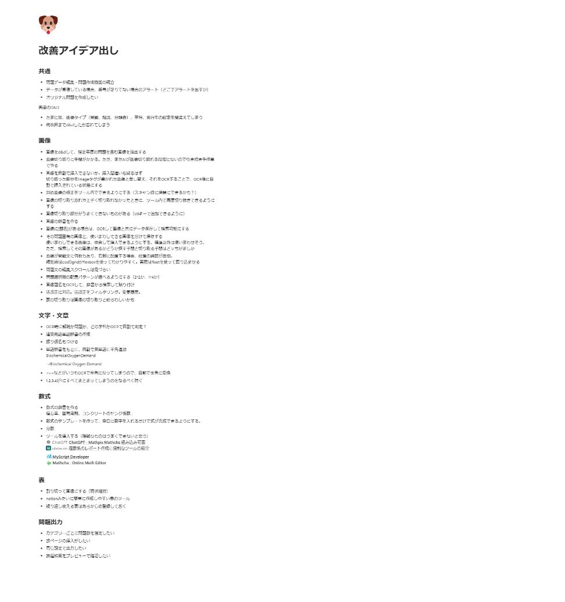

### ペルソナの作成

ヒアリングを通じて、教員から以下の要望が挙げられました。

- 校内で問題の取り込みや編集を行えるようにしてほしい
- 問題画面データの修正の効率化・信頼性の担保
- 問題出力における機能追加（例：出題順をランダムにするなど）

これらをもとに、ペルソナを作成しました。その後、事前に検討した改善案とペルソナをもとに、今回実装する機能を整理しました。

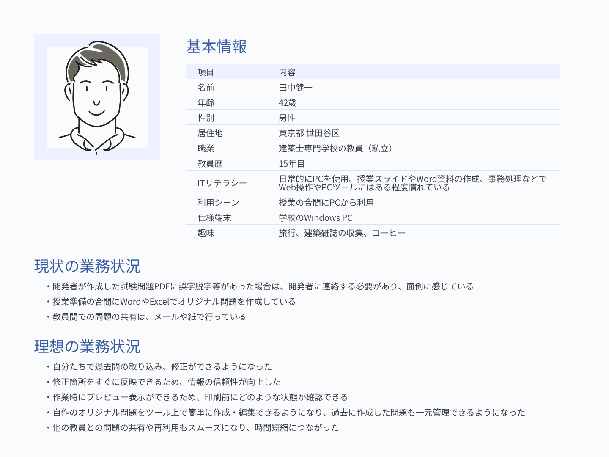

## UIデザイン

課題と要件を整理した後、まずは問題データリスト画面と問題編集画面を優先して制作しました。その後、開発対象が追加されたため、問題集作成画面と模擬試験作成画面の設計・実装に取り組みました。そのため、画面によって異なるプロセスでデザインを進めました。

- ログイン画面、問題データリスト画面、問題編集画面
    - スケッチをもとにFigmaで初期デザインを作成し、その後は実装しながら調整
- 問題集作成画面、模擬試験作成画面
    - カテゴリーや年度などの条件設定部分は、過去に作成した問題作成アプリのUIを流用し、今回のデザインに合わせて調整
    - AIで作成した画面を提示されたため、紙にスケッチしつつ、v0を活用し、実際に実装しながらUIデザインを固めていった

### スケッチ

紙に画面構成を簡単にスケッチし、必要な要素や配置を検討しました。

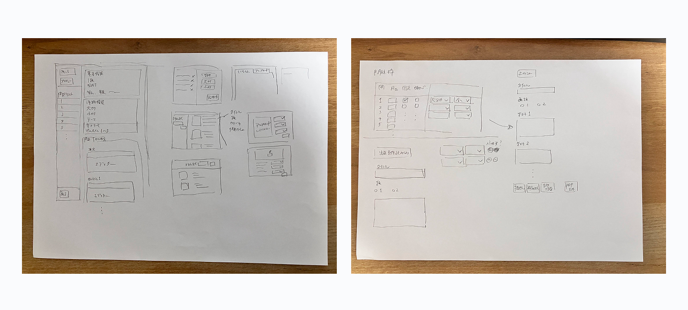

### スタイルガイドの作成

- 色
    - WorkbookApp開発時には未策定だったコーポレートカラーが新たに定められたため、TestManagerではその色をプライマリーカラーとして採用（ポートフォリオ用に色を多少変更）
    - プライマリーカラーを基準にして、黒・黄・赤・緑系統の色を決定。企業のデザインシステムを参考に、明度と彩度を少しずつずらしながら10段階のカラーパレットを作成
    - WorkbookAppでは無彩色のグレーを使用していたが、今回は彩度をあげ、青みのあるグレーを採用し、統一感のある印象を目指した
- タイポグラフィ

    WorkbookAppでAndroid向けに指定したフォントを流用


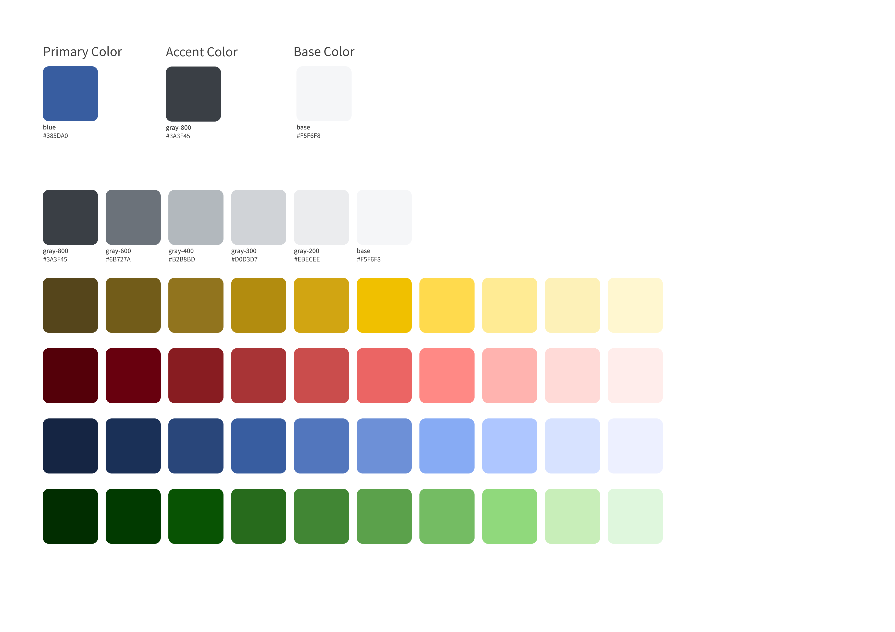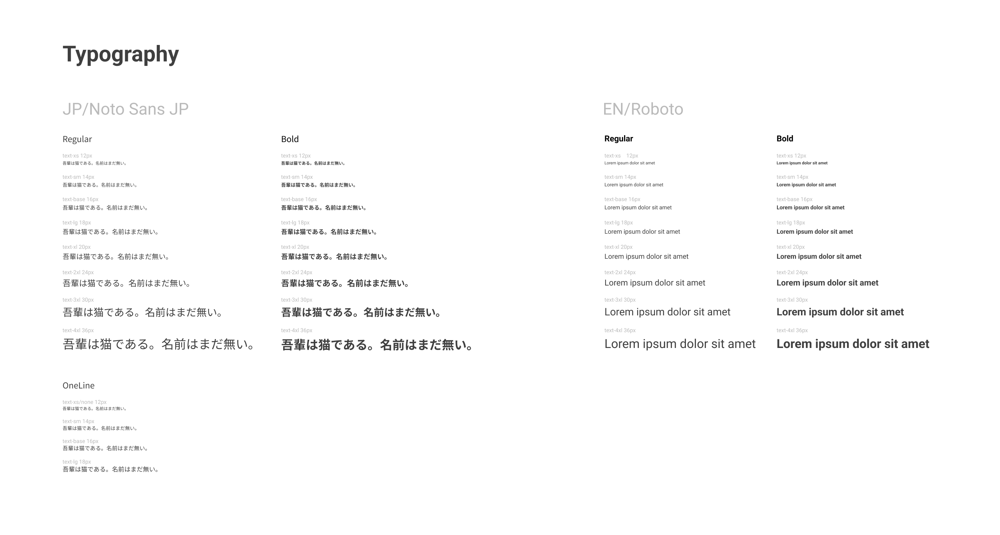

### コンポーネントライブラリの作成

WorkbookAppで作成したコンポーネントをベースに配色を調整し、TestPlatformで新たに必要となったコンポーネントを追加しました。

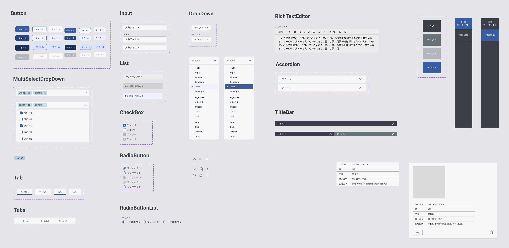

### Figmaでの初期デザイン

問題データリスト画面・問題編集画面は、スケッチをもとにFigmaでデザインを書き起こしました。あくまで初期デザインとし、実装しながらデザインを調整しました。


[Figma](https://www.figma.com/design/Dc6sSAb9blyVnSAd6PHIgF/Test-Platform_%E3%83%9D%E3%83%BC%E3%83%88%E3%83%95%E3%82%A9%E3%83%AA%E3%82%AA%E7%94%A8?node-id=0-1&t=iSdgxRbMhAsjiEQr-1)

### デザインの改善

この項では、デザインで意識した点や改善のプロセスをいくつか紹介します。

#### 問題データリスト上部

データ編集に関するボタンは右側、データ変更や表のレイアウトに関しては左側と役割ごとに分けて配置しました。その後機能が追加されましたが、ボタンが増えた場合のデザインを想定しておらず、仮置きでそのまま一列にボタンを並べてしまい、わかりづらくなりました。そこで、v0を活用し、いくつか出力された案を一部採用し、以下のように改善しました。

- 級の切り替えを、ラジオボタンからセグメントコントロールに変更し、選択している級を視覚的にわかりやすくした
- 級の切り替え・「新規作成」・「編集」といった使用頻度の高いボタン以外は、「その他」の中にオブジェクトごとにまとめて整理した

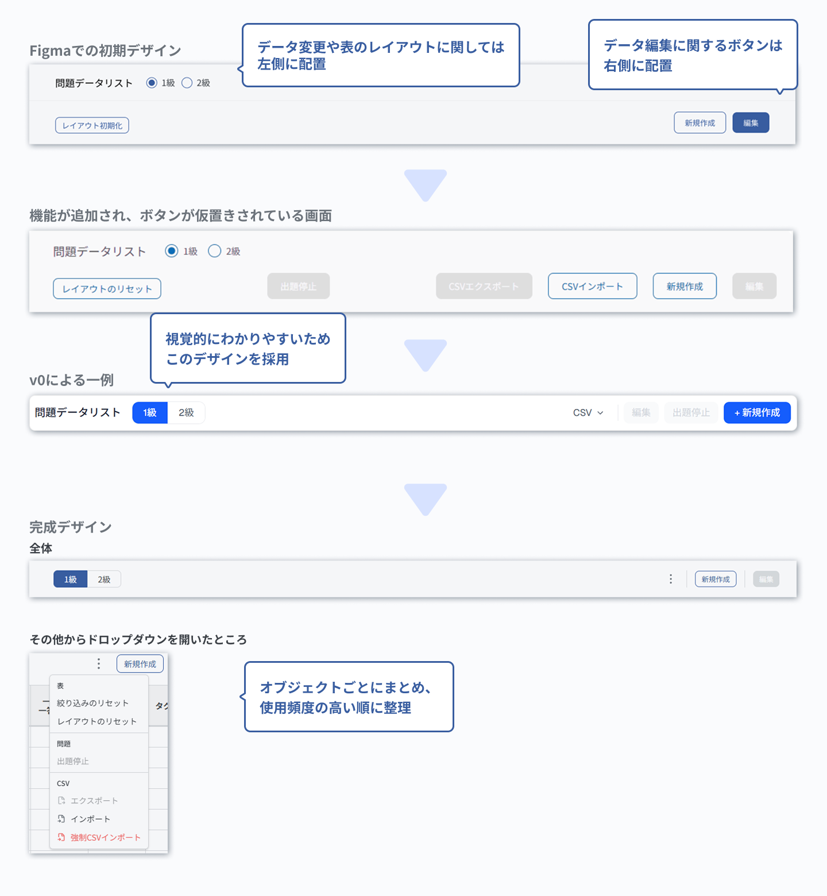

#### 問題編集画面の左サイドバー

プレビューパネルや画像アセットパネルを開くボタンの適切な配置に悩んでいました。複数問題をまとめて保存する機能を追加するにあたって、v0による案を参考に以下のように改善しました。

- 「すべて保存」ボタンを追加し、下に配置
- 「すべて保存」ボタンと間違えて押さないように「戻る」ボタンを上に移動
- プレビューパネルや画像アセットパネルを開くボタンが場所を取っているので、アウトラインボタンからアイコンに変更

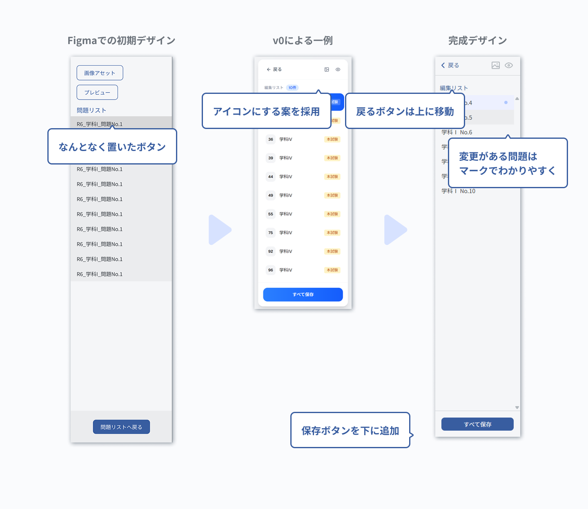

#### 模擬試験作成画面・問題集作成画面の上部

初期の実装では、基本設定、詳細設定、PDF出力の3ステップに分け、ステッパーを画面上部に配置していました。プレビューやPDF出力の可否を表示することにしたため、v0にいくつか案を出してもらいましたが、要素が多くなり視認性が低下していると感じました。そこで、ステッパー方式を廃止したデザインを新たに出力してもらい、以下のように改善しました。

- 基本設定、詳細設定を一画面にまとめ、ステッパーを廃止しスペースを確保
- 小さな丸で表すシンプルな状態表示を採用
- 「初期状態に戻す」ボタンや「インポート」ボタンも同じ並びに配置し、上部の高さを小さくすることで、設定部分の表示領域を確保

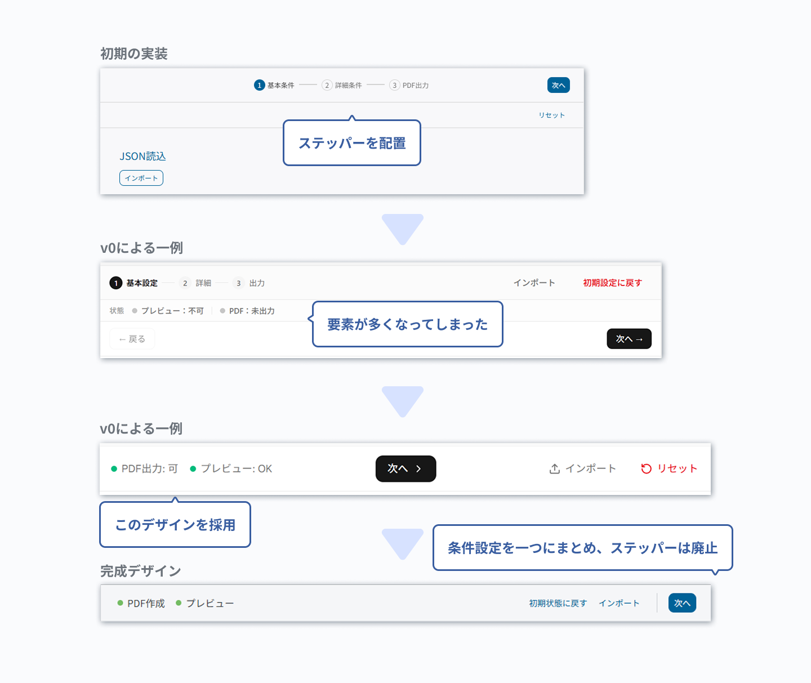

## 画面実装

### 技術選定

UI実装や状態管理に使用するライブラリについて調査・選定しました。主な選定理由は以下のとおりです。

- Zustand：useContextと比較して、必要な状態だけを購読でき、不要な再レンダリングを抑えられる。また、Providerを配置せずに利用できる
- Tailwind CSS：WorkbookAppで導入しており、使い慣れていた
- shadcn/ui：必要なコンポーネントだけを追加でき、Tailwind CSSでカスタムしやすい
- react-data-grid：絞り込みやソートの実装やデザインのカスタムがしやすい
- Dockview：画面の分割や、スムーズな画面の配置変更が実現しやすい

### 工夫した点

#### セマンティックカラーの策定

前プロダクト(WorkbookAppリンク)では、プリミティブカラーをコンポーネントで直接使用していたため、色を変更する際に複数箇所を修正する必要がありました。

そこで、用途に応じたセマンティックカラーを定義し、コンポーネントでは原則としてセマンティックカラーを使用し、それ以外の用途で使用したい色があった場合にプリミティブカラーを使用するルールに変更しました。

例：プライマリーカラーを変更する場合、CSSを以下のように修正するだけで簡単に変更することが可能になりました。

```css
/* 変更前 */
--color-primary: var(--color-blue-500);

/* 変更後 */
--color-primary: var(--color-blue-600);
```

オリジナルのコンポーネントを実装する際は、shadcn/uiのthemeに書かれているセマンティックカラーのみでは足りなかったため、一部を拡張しました。

例：Buttonコンポーネントのホバー時に、デフォルトではhover:bg-primary/80となっていましたが、プライマリーカラーのホバー時の色を定義したことで、プライマリーカラーを使った別のコンポーネントでも一貫した色を選択できるようにしました。

```
--color-primary-hover: var(--color-blue-700);
--color-primary-active: var(--color-blue-800);
```

#### 問題データリストの実装

次回表示時に同じレイアウトを再現するため、列幅、列順、固定位置をZustandで管理し、localStorageへ保存しました。また、肥大化していたDataGridの処理を、行、列、表示に関する役割ごとにカスタムフックへ分割しました。

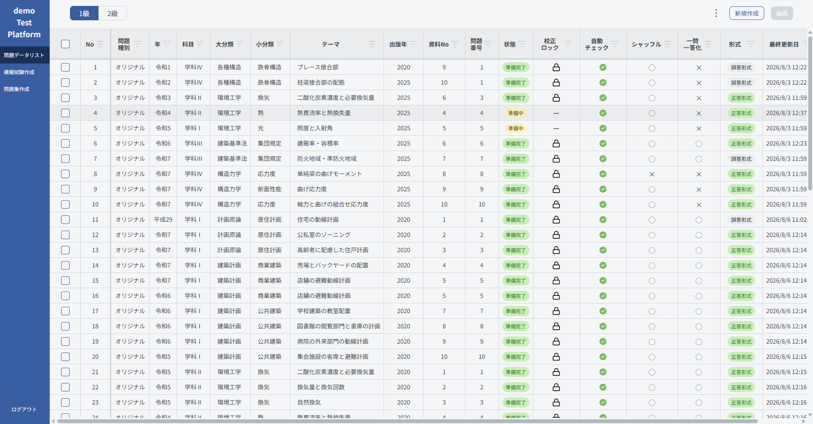

#### 画像アセットの検索と管理

従来の問題管理システムでは、画像の使用状況と使用箇所で絞り込みできた一方、学科や分類の絞り込みには対応していませんでした。そのため目的の画像を見つけづらく、同じ画像が重複した状態になっていました。

そこで今回、級、学科、大分類、小分類による検索を実装しました。現在編集中の問題で使用している画像や、未使用画像の絞り込み、更新日や追加日による並び替えを行えるようにしました。また、学科や分類などのメタデータは編集できるようにしました。

検索部分は一覧表示から独立したコンポーネントへ分け、検索結果のキーと並び替えの状態はZustandで管理しました。

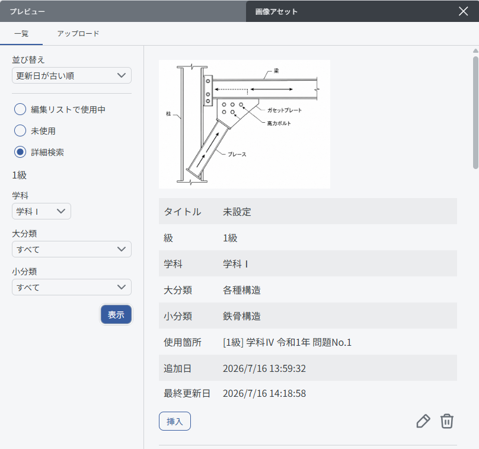

#### 画像アセットの検索結果の表示改善

画像の検索結果を表示する際に、IntersectionObserver を使用しています。要素が監視の範囲内にスクロールしたときに、ダミー画像から実画像に切り替えていました。

しかし、この方式ではスクロール時の動作の遅さ、表示のがたつき、画像のちらつきの問題がありました。

AIに相談した結果、次の問題が見つかったため、修正をしました。

1. Zustandストアをセレクターを使わずに直接呼び出していた部分があったため、関係のない状態が更新された場合にコンポーネントが再レンダリングされていた
→ 必要な状態のみをセレクターで取得するよう修正
2. IntersectionObserverを生成するuseEffectがZustandで取得したimagesStateMapに依存していた。画像の取得状態が変わるたびにObserverの生成と破棄を何度も繰り返していた
→ imagesStateMapを依存配列から除外し、スクロールでObserverが実行された時点でgetStateで最新の状態を取得するように変更

Before

```jsx
const { imagesStateMap } = useAssetCacheStore((s) => s.imagesStateMap);
useEffect(()=>{
	const image = imagesStateMap[targetId];
},[imagesStateMap ])
```

After

```jsx
useEffect(()=>{
	const observer = new IntersectionObserver(async (entries) => {
		const image = useAssetCacheStore.getState().imagesStateMap[targetId];
	})
 },[])
```

修正の結果、不要な再レンダリングは抑制できましたが、がたつき・ちらつきは解消しませんでした。さらに調査したところ、次の問題が見つかりました。

- IntersectionObserverのrootMarginに500pxを指定したため、画面の範囲外でダミー画像から切り替わる想定だったが、実際には画面の範囲内で切り替えが発生していた。
→rootを指定してなかったことが原因。指定しない場合はビューポートがrootとなるため、rootMarginはそこから計算されると考えていた。そこで、スクロール部分をrootに指定することで、画面外で画像で切り替えるよう修正。
- useShrinkImageObserver.tsxで、縮小後の画像が表示幅より大きい場合は、width: 100%、height: auto としていたため、ダミー画像と実画像の高さが異なり、スクロール時にがたつきが起きていた。→高さに実画像の比率を指定

修正後、スムーズにスクロールができるようになりました。

## 振り返り

ボタンやステータスが多い画面では、何を基準に配置を決めるべきか判断に迷うことが多かったため、情報設計について学び、より根拠をもって設計できるようにします。

また、アクセシビリティを考慮したshadcn/uiコンポーネントを使っていた一方、独自コンポーネントを作成する際は意識していませんでした。今後は、もう少しアクセシビリティに関して知見を深めていきます。
