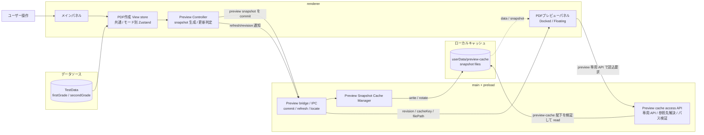

# PDF作成モード DFD

この文書は、PDF作成モード v2 のうち、特にプレビュー更新と描画に関わるデータフロ
ーを整理した設計メモです。

## DFD図

## 責務分担メモ

- View store は業務 state の正本を持つ。作成種別、級、タイトル、問題テーブル、未
反映状態などはここに置くが、更新 command や巨大な preview snapshot 本体は持たな
い。
- Preview Controller は View 配下で動かし、store と取得済み TestData から previe
w snapshot を組み立てる。いつ再生成し、いつ main へ commit するかの判定もここで
行う。
- main 側の Preview Snapshot Cache Manager は、dock 表示と floating 表示をまたぐ
共有元になる。renderer 間共有の正本はここに寄せる。
- Preview cache access API は preview 用の専用窓口として preload から限定公開し、任意 path の readFile は公開しない。
- プレビューパネルは main/preload から通知された filePath を介して最新 snapshot を読み込み、full render する責務に絞る。業務 state の編集や snapshot の組立は持たせない。

## 更新シーケンス

1. ユーザーがメインパネルで条件変更、再抽選、JSON 復元などを行う。
2. View store が更新され、Preview Controller が preview snapshot の再生成要否を
判定する。
3. Preview Controller が main へ snapshot を commit し、main は userData 配下の 
preview-cache へ保存する。
4. main は dock 表示 / floating 表示に対して revision / cacheKey / filePath を通知する。
5. プレビューパネルは preview 専用 API へ読込要求を送り、main 側で preview-cache 配下チェックを通した最新 snapshot を受け取って full render する。

## 実装メモ

- 50MB 級の preview データを getLatest のような IPC で毎回返す設計は避ける。stru
ctured clone のコストが大きく、更新頻度が上がるほど不利になる。
- preview snapshot の更新は coarse-grained に扱う。条件入力のたびに即書き込みす
るより、再抽選、明示的なプレビュー更新、一定 debounce 後の commit を基本にする。
- patch render は PDF 作成モードの優先事項ではない。まずは full render の共通基
盤と cache 共有を成立させる。
- 既存の testDataEditor 向け previewPanel.tsx は単一問題 + patch 前提のため、そ
のまま共通化しない。
- cache の実ファイル読込は preload で公開する preview 専用 API が担当し、renderer に汎用的な fs 権限や任意 readFile API は渡さない。
- main 側は受け取った filePath をそのまま信用せず、resolve / normalize / realpath などで正規化したうえで preview-cache 配下かを検証する。範囲外の path は拒否する。
- 可能であれば renderer からは cacheKey を主に渡し、main 側が内部管理している対応表から filePath を解決する。filePath は通知用メタ情報として扱い、認可の根拠にはしない。
- 問題集モードと模擬試験モードは同じ snapshot 契約を共有し、レイアウト差分は sna
pshot の page metadata と renderer 側の full render に閉じ込める。
