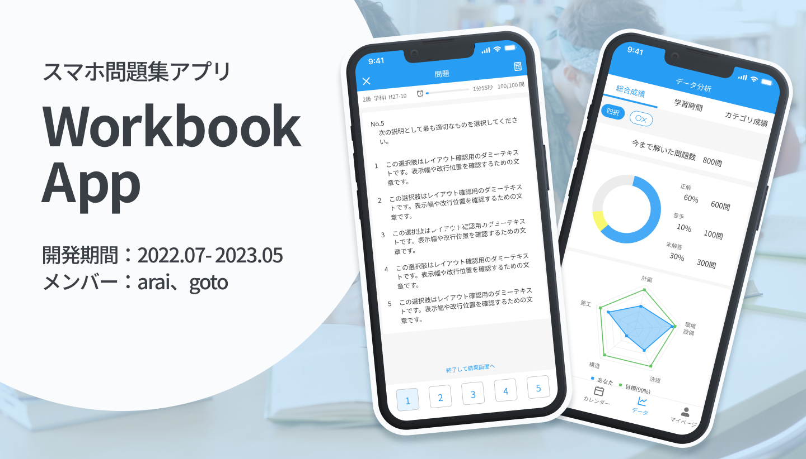
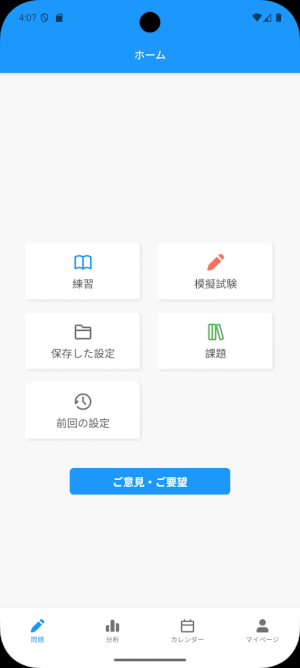
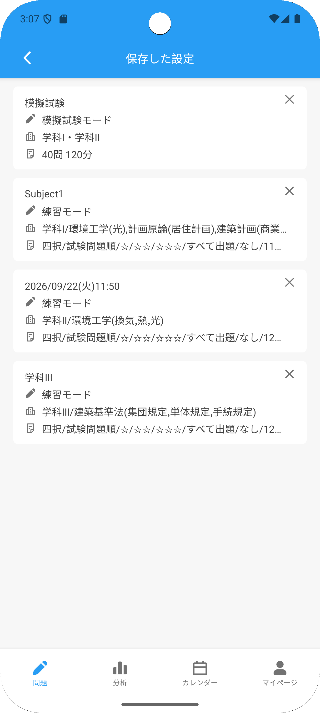
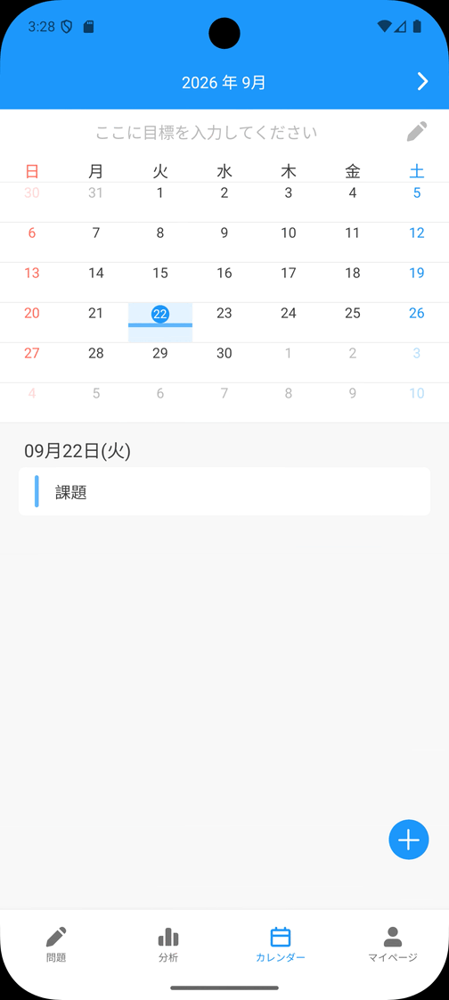
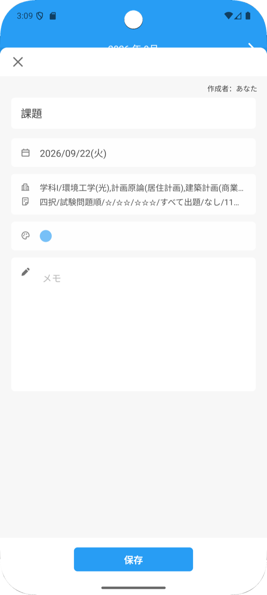
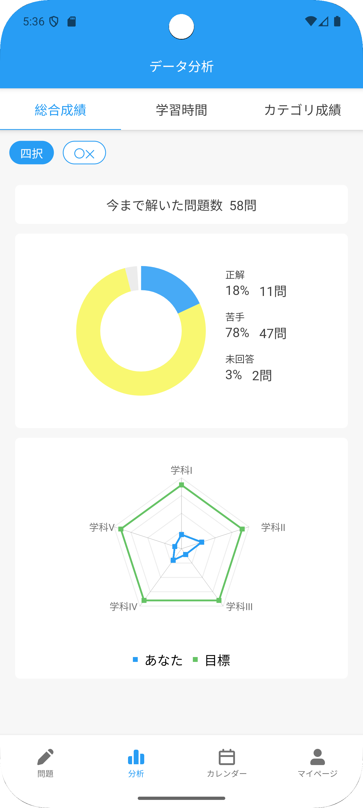
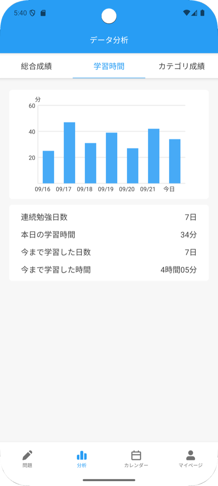
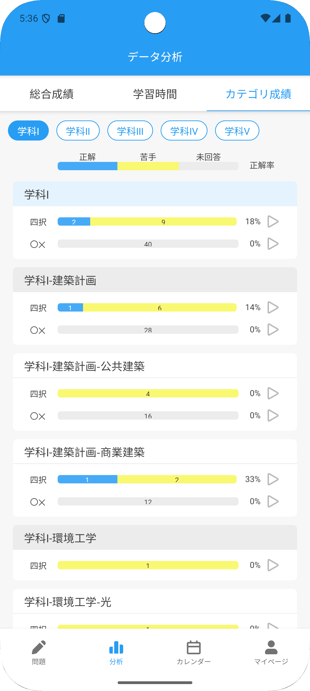
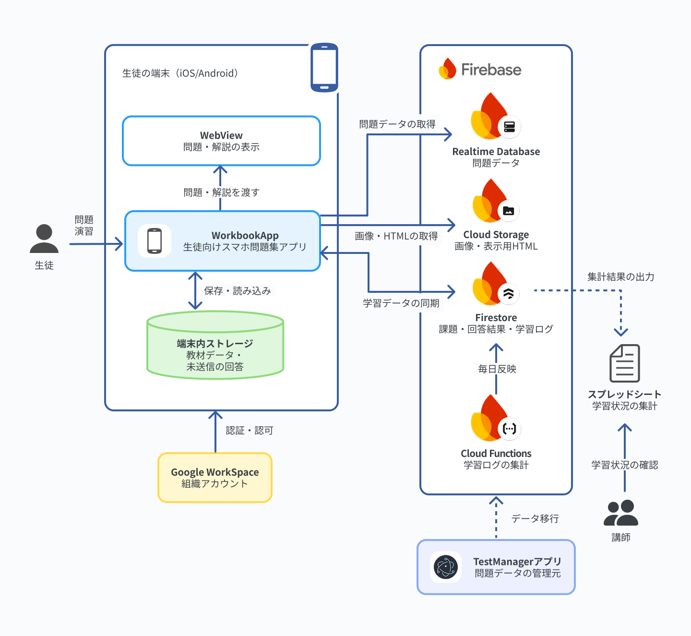

# スマホ問題集アプリ「WorkbookApp」

執筆者：arai

## 目次

- [概要](#概要)
- [期間](#期間)
- [開発経緯・目的](#開発経緯目的)
- [開発メンバー・担当範囲](#開発メンバー担当範囲)
- [開発方針・気をつけたこと](#開発方針気をつけたこと)
- [主な機能](#主な機能)
  - [問題演習](#問題演習)
  - [問題設定保存機能](#問題設定保存機能)
  - [課題登録・スケジュール管理機能](#課題登録スケジュール管理機能)
  - [進捗分析機能](#進捗分析機能)
  - [オフライン対応](#オフライン対応)
- [システム構成](#システム構成)
- [各種資料リンク](#各種資料リンク)
  - [関連ページ](#関連ページ)
  - [ソースコードとローカル起動](#ソースコードとローカル起動)

## 概要
WorkbookAppは、データ化した過去問を、生徒が自宅や通学中に学習できる形で提供した学内向けのiOS/Android問題集アプリです。

**生徒がスキマ時間に学習機会を確保しやすくするため**に、出題範囲や難易度を指定して問題に取り組み、出題設定を保存、課題と学習予定の管理を行えるようにしました。

学習進捗を記録し、生徒自身による振り返りに加えて、講師による課題配信と学習状況の集計にも利用できるようにしました。

※ 本ページ上で使われている問題・解説データは全てダミーです。内容の正しさは保証されていません

## 期間
- **開発期間**：2022年7月から2023年5月頃
- **運用期間**：2023年5月から2025年11月頃

2023年5月にiOS版とAndroid版を学内向けに配布し、約2年半にわたって運用と保守を行いました。

運用期間中には、生徒が自宅学習に使用した実績があります。現在は、取引先側の運用体制再編に伴い運用休止中です。

## 開発経緯・目的
旧データ化システムで、紙の過去問のデータ化ができるようになった一方で、その活用先が紙の問題集や模擬試験に限られていました。

試験勉強では、生徒は短期間に数千問以上の問題を解けるようになる必要があり、従来の紙の問題演習だけでは不十分で、特にスキマ時間に手軽に問題を解けるようにしたいという要望がありました。

また学内では、通学中などのスキマ時間に学習ができる手段を確保し、生徒の日々の学習状況や生徒が苦手な問題や傾向、学習時間を把握したいというニーズがありました。

そこで、iOS / Android両方で使える問題集スマートフォンアプリを作り、それを生徒に使ってもらい、学校ではその使用データを収集・解析することを目的に作りました。

## 開発メンバー・担当範囲

本プロジェクトは2名で開発しました。

担当領域を分けつつ、必要に応じて互いの領域を補完しながら進めました。

| メンバー | 主な担当                                              |
| ---- | ------------------------------------------------- |
| arai | 取引先との調整、技術選定、全体設計、環境構築、フロントエンド基盤、バックエンド           |
| goto | UI / UX関係の技術選定、デザイン、画面とコンポーネントの実装、Storybookのストーリー作成 |

個別の設計判断や実装内容、より詳しい責任範囲については、それぞれのContributorページで説明しています。

- [araiのContributorページ](docs/contributors/arai.md)
- [gotoのContributorページ](docs/contributors/goto.md)

## 開発方針・気をつけたこと
学内の生徒に配布するアプリということを意識して、実際に生徒が使ってもらえるようなアプリを目指しました。

要件整理段階では、まずユーザーストーリーを作成して、想定される利用場面を整理することにしました。それをもとに、ユースケース図を作成して、生徒・講師・クライアント・バックエンドの関係性を可視化し、画面デザイン案をfigmaで作成しました。

これらは依頼主にも共有し、いただいたご意見をもとに調整していきました。

開発では、動くプロトタイプを優先して作成しました。実際に試して、そこで判明した問題や改善点をフィードバックしながら完成度を高めていきました。

[ユースケース分析資料](docs/designs/usecaseAnalysis.md)

## 主な機能
### 問題演習

カテゴリや問題数、難易度、出題形式などの出題条件を設定すると、その設定にあった問題がランダムに選ばれ出題されます。

問題ごとの正誤・解説も表示され、正誤情報も記録されます。問題ごとに苦手マークをつけることで、出題設定で苦手な問題を重点的に解くこともできます。

通常の問題集モードのほかに、実際の試験の形式に則った時間制限・出題がされる模擬試験モードもあります。

### 問題設定保存機能

よく使う問題設定は、保存して何度も呼び出して使うことができます。

設定は自由に名前をつけられ、あとから削除することもできます。

生徒は、カテゴリごとに集中して勉強することが多いことを踏まえ、この機能を作成しました。

### 課題登録・スケジュール管理機能

講師が生徒に、期間限定の課題を課すことができます。課題が送信されると、期間中メイン画面で通知され、アプリ内カレンダーにも表示されます。

また、アプリ内で自分用の課題や学習計画を登録することもできます。

### 進捗分析機能

自分の問題演習の進捗を確認して、どれが苦手か、あまり勉強できていないカテゴリなのかを分析できます。

データベース上では、本日分・本日分以前のデータを分けることで、日々の進捗と通期の進捗を分けて表示することができるようにしました。

また、これらのデータを集計し、講師が学習状況を確認・分析するための資料としてスプレッドシートに出力できます。

### オフライン対応
通学時に電波が不安定な場合を考慮して、ログインやデータリセットなどの一部機能を除き、オフラインでもアプリが動かせるようにしました。

firebaseのオフライン機能を使うことで、オンライン時にも不整合が起きづらい設計にしました。

## システム構成
WorkbookAppは、生徒の端末で動作するスマートフォンアプリと、データを保持するクラウド基盤で構成されています。

- **クライアント**：Expo / React Nativeで開発したiOS / Androidアプリ。問題データと画像は端末内に保存し、オフラインでも学習可能
- **バックエンド**：Firebase。全利用者に共通する問題データとアセット情報はRealtime Database、利用者ごとに分かれる課題・回答結果・進捗はFirestore、画像などのファイル本体はCloud Storageで扱う
- **認証**：取引先組織のGoogle Workspaceアカウントを利用し、講師と生徒を区別
- **他システムとの接続**：問題解説は、旧データ化システムでデータ化したものを取り込む。学習状況の集計結果は、講師が確認できるようスプレッドシートへ出力

## 各種資料リンク
### 関連ページ

- [TestPlatformプロジェクトの説明](../../README.md)：TestPlatformプロジェクト全体の構成と、各プロダクトへ至る経緯
- [araiの担当・実績紹介](docs/contributors/arai.md)：araiのWorkbookAppにおける取り組みを紹介しています
- [gotoの担当・実績紹介](docs/contributors/goto.md)：gotoのWorkbookAppにおける取り組みを紹介しています
- [ユースケース分析資料](docs/designs/usecaseAnalysis.md)

### ソースコードとローカル起動

- [クライアントのソースコード](client)：Expo、React Native、TypeScript
- [バックエンドのソースコード](backend)：Cloud Functions、Realtime Database / Firestore / Storage Rules
