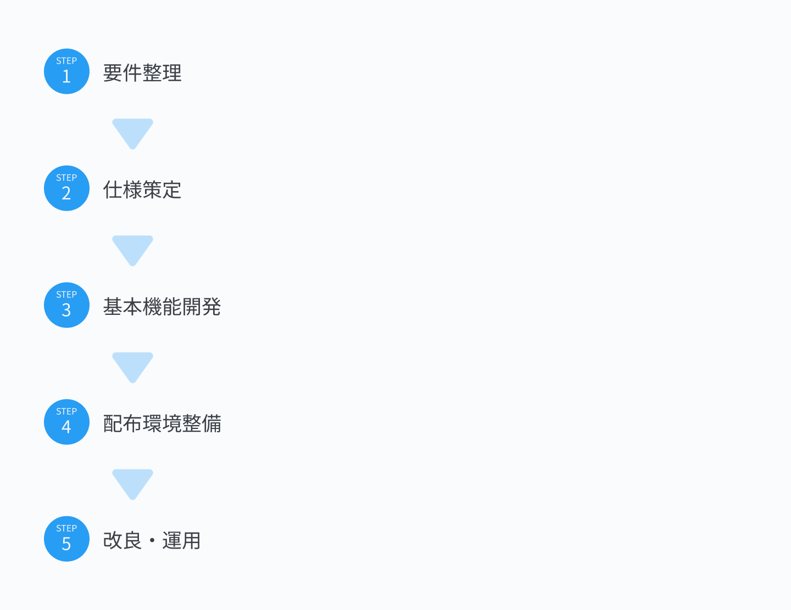
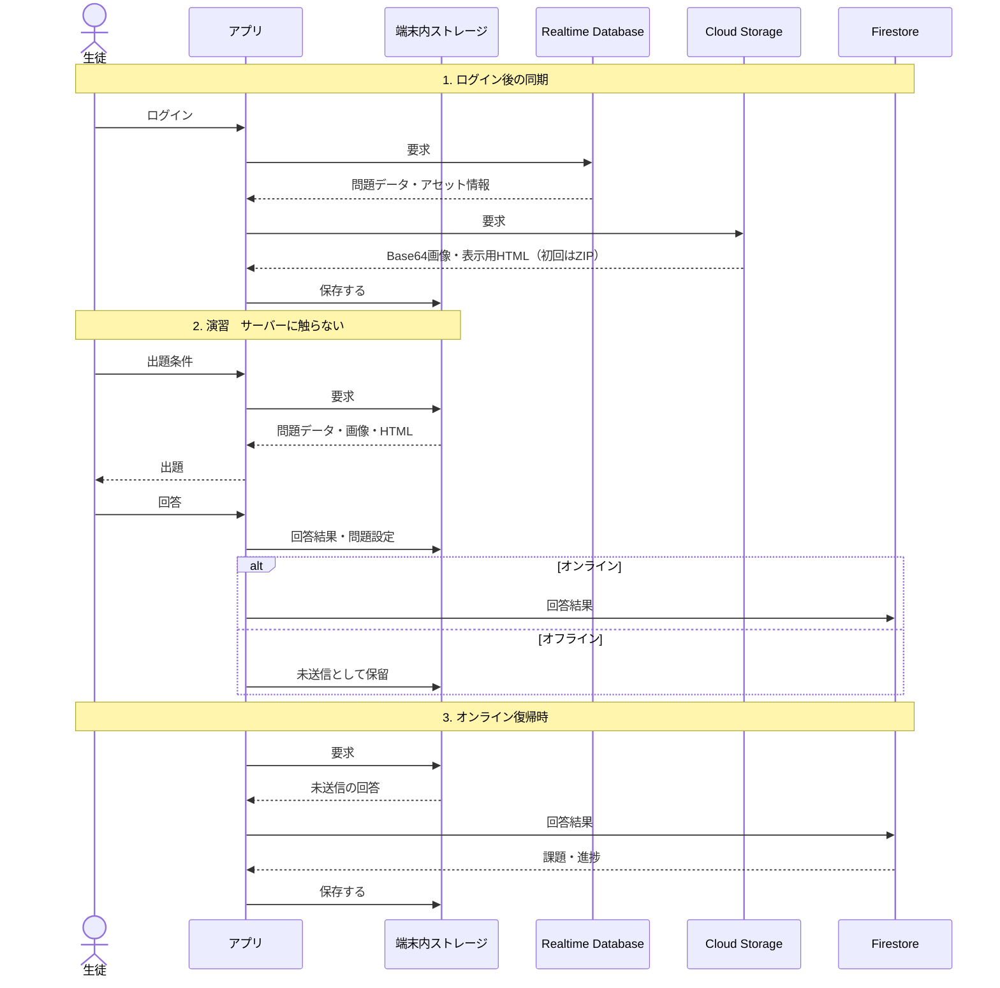
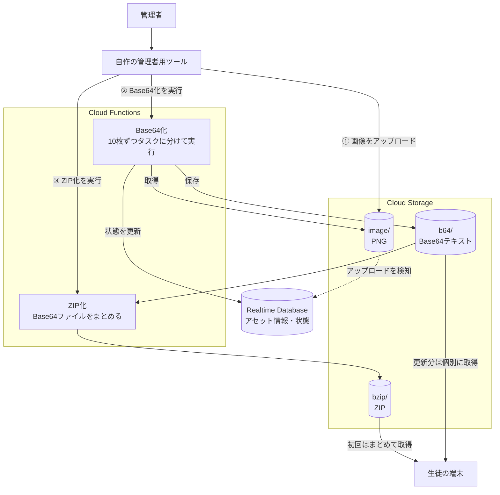
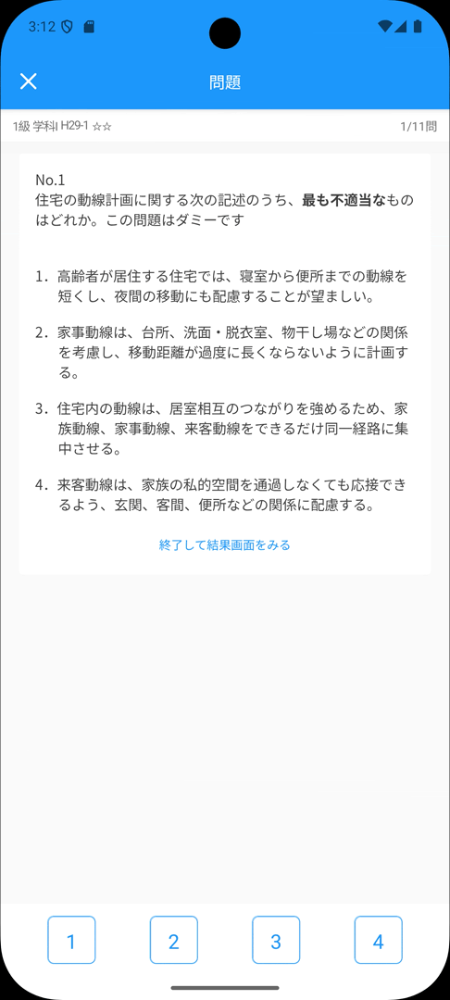
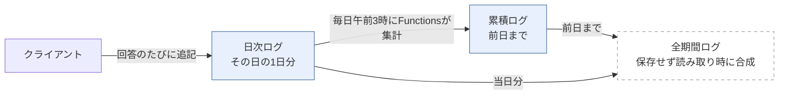

# araiの担当・実績 | WorkbookApp

執筆者：arai

## 目次

- [概要](#概要)
- [担当責務・責任境界](#担当責務責任境界)
- [開発の進め方](#開発の進め方)
  - [要件整理と仕様策定](#要件整理と仕様策定)
  - [タスク管理と進捗共有](#タスク管理と進捗共有)
- [アーキテクチャ](#アーキテクチャ)
  - [全体設計](#全体設計)
  - [フロントエンド](#フロントエンド)
  - [バックエンド](#バックエンド)
- [振り返り](#振り返り)
  - [よかった点](#よかった点)
  - [見直しが必要な点](#見直しが必要な点)
- [関連資料](#関連資料)
  - [関連ページ](#関連ページ)
  - [開発当時の資料](#開発当時の資料)
  - [ソースコードとローカル起動](#ソースコードとローカル起動)

## 概要


このページでは、問題集アプリWorkbookAppの開発に、要件整理から全体設計、フロントエンド基盤、バックエンドまでを担当したaraiがどのように携わったかを紹介します。

スマートフォンアプリの開発経験がない状態から技術調査を始め、取引先と調整しながら設計・開発を行い、iOS/Androidで学内配布を行いました。その後、約2年半にわたり運用と保守を行いました。

本ページでは、単にうまくいった点だけではなく、経験の浅さから直面した困難に対してaraiがどのような判断をしたか、後から見た反省点などもあわせて書いています。

WorkbookAppの詳細な説明については、[こちら](../../README.md)の参照をお願いします。

## 担当責務・責任境界

| 領域         | 担当      | 内容                                                            | 責任境界                                |
| ---------- | ------- | ------------------------------------------------------------- | ----------------------------------- |
| 要件整理と取引先折衝 | 主担当     | ヒアリング、ユースケース分析、仕様提案、取引先との調整                                   | UI/UXとデザインの詳細はgotoと相談して決定           |
| 技術選定と全体設計  | 主担当     | 技術調査、採用技術の選定、クライアントとバックエンドを含むシステム構成、データフローの設計                 | UI/UXに関わる判断ではgotoの意見を反映             |
| 開発環境       | 主担当     | 開発環境の構築、開発ルールの策定、ビルドとデプロイ                                     | 画面実装に関わる環境調整はgotoを支援                |
| フロントエンド基盤  | 主担当     | コンポーネント階層、Identityコンポーネント、状態管理Hooksなどの設計と実装                   | 画面のデザインとレイアウトはgotoが中心となって担当         |
| UI/UXと画面実装 | 支援と一部実装 | 共通基盤との統合、技術面の支援、一部画面と難度の高い機能の実装                               | デザイン、画面上の配置、UI/UXに関する技術選定はgotoが主担当  |
| 品質確認       | 共同担当    | Storybookを使ったコンポーネント単位の表示と操作の確認                               | Storyの作成はgotoが中心となって担当              |
| バックエンド     | 主担当     | データ構造、認証、データ同期、進捗集計、課題機能、既存データの移行などの設計と実装                     | バックエンドはaraiが中心となって担当                |
| 技術的難所      | 主担当     | WebViewによる問題と解説の表示、事前読み込み、部分的なオフライン対応、性能問題への対応                | UI上の見せ方はgotoと調整し、処理方式の設計と実装はaraiが担当 |
| 配布と運用準備    | 主担当     | TestFlightとFirebase App Distributionによる配布、配布ページ、導入手順、更新配信への対応 | 利用者向けの見せ方はgotoと協力して調整               |
| タスク管理      | 主担当     | 画面、コンポーネント、パーツ単位のタスクリスト作成と進捗管理                                | 各担当領域の実装は互いに補完しながら進行                |

役割としては、gotoがUI/UXのデザインと画面上の配置を中心に担当し、araiが要件整理、技術方針、開発環境、フロントエンド基盤、バックエンドを中心に担当しました。

フロントエンドは担当を完全に分けず、gotoが画面とコンポーネントを実装する一方で、araiも共通コンポーネント、状態管理、機能統合、技術的難度の高い箇所を設計して実装しました。

## 開発の進め方

<p align="center" ></p>

本プロダクトは既存プロダクトのリプレースではなく新規運用だったことから、まずは実際に運用できる最低限の機能を持ったアプリを配布して、実際に使用してもらいながらフィードバックをもらい、不具合修正と機能改善のサイクルを繰り返し行うような進め方にするよう提案し、承認・実行しました。

なるべく、実運用に即した機能改善を行えるように、学内サポートだけでなくアプリ内の不具合報告・ご意見フォームを設置するなどして、多くの使用者の声を拾えるよう工夫しました。

### 要件整理と仕様策定

開発前の要件整理段階では、まず依頼主から要件をヒアリングして要件定義書を提案しました。これらをもとに、ユーザーストーリーとユースケース図を起こし、実際に使われる現場でのユースケースを意識して仕様を依頼主に改めて提案しました。

このユーザーストーリーから、通学時のオフライン対応の必要性やデータの同期仕様の検討、画面UI/UXの決定などの仕様を決定していきました。

その後、バックエンド構成やデータ構造などの変更コストの高い判断を先に整理しておき、画面や細部の仕様はプロトタイプの検証やフィードバックに応じて適宜調整していきました。

 [ユースケース分析資料](../designs/usecaseAnalysis.md)

### タスク管理と進捗共有

本プロダクトでは、スプレッドシートに画面やコンポーネント、不具合単位の共有スプレッドシートを作り管理しました。

不具合一覧は、依頼主にも共有し追加してもらうことで協働して不具合改善を行うことができました。

一方で、コンポーネントに直接紐づかない状態管理やバックエンドの機能、設計などの作業は十分にタスク化できず、特にそういった部分を担当していたaraiのタスクが内外の関係者からみえるづらくなってしまう問題が開発中に発生してしまいました。

この問題が顕在化した頃には開発はすでに運用・改良フェーズに入っていたため、不具合スプレッドシートでタスクのみえる化と共有はある程度改善されることになりました。

これらのタスク管理や作業のみえる化は関係者共通の反省点として挙げられ、次の[TestManagerプロダクト](../../../test-manager/docs/contributors/arai.md)で改善を行いました。


## アーキテクチャ

<p align="center" ></p>

この章では、このアーキテクチャをどのような判断から決定し、どのように実装し、どのような困難があったかを紹介させていただきます。

### 全体設計

要件整理とユースケース分析の結果、以下のように要件を整理した。

1. iOS/Androidへのマルチプラットフォーム対応
2. 最大アクティブユーザー人数は100人〜300人程度
3. 旧問題集作成アプリで出題可能な問題が同じ出題形式(選択肢・一問一答形式)で出題可能であること
4. 回答結果はSaaSなどのクラウドデータベースに保存し、加工・分析が可能なようにすること
5. 簡易的なユーザー管理が可能なこと
6. 通学中、通信が不安定になる可能性があるため限定的にオフライン対応が可能であること
7. 関係者以外、アプリの使用ができないように認証・認可の仕組みを導入すること
8. メンバーはスマホネイティブアプリの本格的な開発は初めてであり、技術的な障壁が高いため、学習コストはなるべく下げる必要がある。過去の技術的資産(問題データスキーマや表示ロジックなど)は可能な限り再活用する

特に、回答結果を分析できるようにする・使用を学内に限定する認証・認可の仕組みを用意することや、アクティブユーザーの数や機能の規模を考えると、従来のスプレッドシートをデータベースとして使用するのは難しいと考えSaaSの活用を提案しました。

同時期に依頼主の組織でGoogle Workspaceを導入しました。そこでGoogleアカウント認証とそれを活用しやすくオフライン対応機能が標準で備わっているFirebaseをバックエンド基盤に利用することにしてフレームワーク選定に移りました。

#### フレームワーク選定

フレームワークの選定をするために技術調査を行い、フレームワークごとの特徴を分析してまとめました。

| 候補                | 学習コスト            | 外部資料                          | OSSパッケージの充実 | 既存資産の活用 | 継続保守の見通し | その他                                             |
| ----------------- | ---------------- | ----------------------------- | ----------- | ------- | -------- | ----------------------------------------------- |
| Expo/React Native | △                | △（日本語資料が少ない）                  | ○           | ○       | ○        | Reactベースであり、webの知見を利用できる                        |
| Flutter           | △                | ○（日本語公式ドキュメントは少ないがQiita記事は多い） | △           | ×       | ○        | 2022年当時、日本のモバイルアプリ開発で最もホット                      |
| Cordova           | ○                | △                             | ○           | ○       | △        | WebViewベース・electronプラグインあり                      |
| Ionic + Cordova   | ×（Angularの習得が必要） | △                             | ○           | △       | △        | Angularベース                                      |
| Unity             | ○                | ○                             | △           | ×       | ○        | メンバーにUnity使用経験がある。ゲーム的な演出がやりやすいがモバイル向けのUIは組みづらい |
※ 2022年当時の状況とメンバーのスキルを勘案した表です。現在の状況とは異なります

この中からUnityは、既存資産を活かしにくいこと・モバイル向けのUIは組みづらいこと、ゲーム的な機能が今回は不要なことから除外し、Cordova系のガワアプリはAngularの習得コストやガワアプリの制約がオフライン対応などとの適合が難しいと思われたことから除外しました。

他方で、Expo/RNとFlutterはどちらもネイティブアプリでありios・Androidアプリとしての要件は満たしており、既存資産の活用も可能と判断しました。

Flutterはマルチプラットフォーム展開に優れていた一方、Expo/RNはReactベースで既存JS/TSのOSSパッケージの多くを使用することができました。

今回、私たちはスマートフォンネイティブアプリの開発経験が少なく、すでにコスト管理上のリスクを負っている状態でした。そのため、OSSパッケージ資産やWeb開発の知見を利用しやすいExpo/RNを選択することにしました、。

これにより、既存の知見を一部活用してネイティブアプリ開発を望むことができた一方で、日本語ドキュメントやコミュニティの少なさは特に不具合修正の局面において苦しむことになりました。

#### オフライン対応とデータ配置



##### 背景
このアプリの開発にあたって、まずデータの配置や流れ(データフロー)を要件に基づいて決めていく作業からはじめました。

このアプリのデータフローに関わる初期の要件としては以下のようになっていました。
- 数千問の問題データと、数千枚の画像アセットを扱っている
- 通学中のような通信環境が不安定な場面でも、問題演習が止まらないようにする必要がある
- 問題や解説の表示にはjs・CSSが動作可能なhtmlを表示できるwebViewが必要

この要件に適合するデータフロー仕様を検討することにしました。
##### 検討
まずどの程度オフラインで動作するようにするかという、オフライン対応の範囲の検討からはじめました。通学程度の伝搬環境の不安定さであれば、一部使えない区間があっても、乗車駅から目的駅まで完全に不通ということは稀であることから、完全なオフライン対応は不要と判断しました。

そこで、今回のオフライン対応の要求基準として、「オフラインでもログイン後であれば問題演習を自由に設定して行えること」としました。  
したがって、ログインや級の切り替えのようなアプリ本体の状態変更までローカルで完結させる必要はなく、演習が行える状態にするのが今回の方針となりました。

上記の方針をもとに、データのローカルでの持ち方を考えました。

最低限、問題演習を行うには次のデータやアセットが必要です。
- 画像アセット
- 問題データ
- 回答結果
- 問題設定
- 課題データ
- webView読み込み用html

これらは、ログイン後にローカルで事前に保持されている必要があります。

そのためログイン後のローディング画面を用意して、これらの中でサーバー側にある必要なアセットやデータを事前にローカルに同期保存することにしました。

演習をローカルでも実行できるようにするために、ネイティブのwebViewのローカルhtml読み込み機能を利用して実現することにしました。

またデータの内、ユーザー自身の課題データや回答結果はローカルとfirestoreの双方で同期保存するようにしました。オフライン時は、タイムゾーンに保存しつつ、更新履歴を残しておき次回オンライン時にこの更新履歴情報を送信することで同期します。

問題設定は、ローカルにのみ保存することにしました。これにより複数端末で問題設定の共有はできなくなりました。複数端末の使用は保守コストを鑑みて、依頼主と相談のうえ、完全なデータ同期はしない限定的なサポートに留めることにしました。


##### 予期せぬ問題とその解決
この方針で実装をはじめました。実装中や運用中にいくつかの問題が発生し、その対応に悩みました。

1. リクエスト数が多すぎて、ローディングに時間がかかりすぎてしまった
初回ダウンロード時に、数千枚の画像をリクエストしていたため、ダウンロードに体感で時間がかかってしまいました。リクエスト数を減らすために、ダウンロードする画像の大半をzip形式にまとめてリクエスト数を抑制することにしました。

ただし、更新画像などで差分ダウンロードが発生した場合や解凍の失敗などで不足ファイルが発生した場合に備え、従来の個別ダウンロードも維持しました。リクエストが減ったため、ダウンロード時間は早くなりましたが、そのぶん処理の複雑性は増し、画像とzip両方を残したためStorageの使用量も約二倍に増加しました。

2. ローカルの回答結果とfirestoreの回答結果の整合性が取れない場合があった
オフライン時の回答結果の適用に際し、複数端末の使用を許容したこともあり、firestoreの履歴とローカルの履歴で競合や食い違いが発生する場合がありました。これらの適用の順番を誤ると、正解したはずの問題が不正解になるなどの悪影響がありました。

また、日時情報は保存していましたが、ロケーションを意識していなかったため、海外での使用などの場合、日時情報がズレてしまうなどの問題もありました。

そこで、回答データに必ずUTC+9(東京)を基準にタイムスタンプを付与し、このタイムスタンプの古い順に沿って適用しました。

3. ローカルhtml読み込みのCORS制約
ローカルのhtmlをwebViewで読み込む場合、スマホアプリーー特にiOSでは、CORSの制約が厳しく、設定変更だけではローカルhtmlから外部リソースをどの端末でも安定して読ませることができませんでした。

そこでローカルhtmlからの外部リソース読み込みを諦めて、スクリプトや問題データ、画像を全て埋め込み単一htmlで表示を行うことで解決することにしました(詳細は、[WebViewによる問題表示と先読み](#webviewによる問題表示と先読み)を参照してください)。


##### 結果
データフロー構築においては、様々な問題や予見できなかった制約にあたりましたが、工夫や設計変更によって解決できました。

一方で、問題に対して仕様や機能の追加で対応したことにより当初設計より仕様が想定以上に複雑化してしまいました。コードの保守コストが増大し、運用上の課題になってしまっています。

### フロントエンド

フロントエンドでは、主にaraiは状態管理Hooksや遷移、ローディングや通信などの共通基盤と一部の技術的な難所の実装を担当しました。

データ経路の策定やコンポーネント分類などのルールや手続きを決めて実際にそれらを実現可能なように作り上げる役割を持っていました。

#### 独自のコンポーネント分類の策定

今回のアプリは中規模程度になることが予想され、コンポーネント単位も開発初期からある程度揃える必要があると考えました。そこで、gotoと二人で他の類似の開発現場の手法を調査した結果、AtomicDesignの採用を検討することにしました。

この手法は、再利用性やデザインの一貫性、ロジックの分離がわかりやすくなる点などは非常に魅力的だと感じました。

しかし、どのコンポーネントがどのレイヤーに属するか判断するコストが上がる、コンポーネントの数が肥大化し管理が難しくなるーー特に、全画面共通のpublicなコンポーネントと画面独自のprivateなコンポーネントの区別がつかなくなるなど、検討と試験的な運用を通じて問題点も見えてきました。

そこで、以下のような変則的なAtomicデザインルールを本プロダクトでは適用しました。

| 分類            | 主な責務                                                                              |
| ------------- | --------------------------------------------------------------------------------- |
| `Identity`    | UI部品に共通する基本構造、状態、振る舞いを定義する。`Atomic DesignのAtoms`とは違い、単独では使用せず、`Parts`からラップして利用する。 |
| `Parts`       | ボタンや入力欄など、画面を構成する基本的なUI部品を定義する。                                                   |
| `Organisms`   | 複数の`Parts`を組み合わせ、ヘッダーや問題表示欄などの機能単位を構成する。                                          |
| `Views`       | `Organisms`や`Parts`を組み合わせて画面を構成し、画面内のデータとイベントを取りまとめる。                             |
| `Pages`       | データの読み込みとページ単位の状態を管理し、表示する`View`を切り替える。                                           |
| `Functionals` | API通信やデータ処理など、表示を持たない機能を定義する。                                                     |
| `Hooks`       | 表示から分離した状態管理と操作ロジックを定義する。共通HooksとView固有Hooksに分ける。                                 |
| `ViewModals`  | View構造を内包しているモーダルの定義に使用する。                                                        |

UIコンポーネントは、原則として`Pages`、`Views`、`Organisms`、`Parts`、`Identity`の順に組み合わせます。

全画面で利用するコンポーネントは共通フォルダへ置き、特定のViewだけで利用する`Parts`、`Organisms`、`Hooks`、`ViewModal`は、そのViewの配下へ置きました。これにより、共通コンポーネントと画面固有のコンポーネントを配置場所から区別できるようにしました。

```text
components/
├── identities/                     基本の振る舞いと状態を定義
│   └── appText.tsx
├── parts/                          Identityをラップして見た目を与える
│   └── alertLongButton.tsx
├── organisms/                      Partsを組み合わせた機能単位
│   └── categoryAccordionMenu.tsx
├── hooks/                          共通の状態と操作
├── functionals/                    表示を持たない処理
├── viewmodals/                     View構造を内包する共通モーダル
│
├── views/
│   ├── questionResultView.tsx      固有のコンポーネントを持たないViewは1ファイル
│   └── calendarView/               固有のコンポーネントを持つViewはフォルダ
│       ├── index.tsx
│       ├── hooks/
│       │   └── useCalendarViewContext.tsx
│       ├── parts/　　　　　　　　　　ViewごとのPrivateなParts/Organisms等は
│       ├── organisms/　　　　　　　 配下のフォルダに置く
│       │   └── calendarSelectedDateTaskList.tsx
│       └── viewModals/
│
└── pages/                          ページごとにひとつ。読み込みとページ単位の状態を持つ
    ├── loadingPage.tsx
    └── mainPage/
        └── navigators/             ひとつのPageが複数のViewを切り替える
            ├── tabNavigator.tsx
            ├── modalNavigator.tsx
            └── testNavigator.tsx
```

※ [開発初期のコンポーネント設計資料](../designs/componentsGuide.md)

#### 状態と同期の集約

##### 背景
本アプリの設計上の課題として、状態の保持の方法をどうするかという問題がありました。
1. このシステムでは数千問の問題データと、数千枚の画像アセットを扱っています。性能に幅のあるスマートフォンでこれらを処理していく場合、処理の負荷を生徒に感じさせないようにする必要があります。
2. 回答データ(ユーザーが問題を回答した履歴)やユーザーデータなどは、加工され、多くの画面やコンポーネントで使用されます。これらの加工処理を処理の末端で何度も行うとパフォーマンスに悪影響があるため、加工処理は最低限にする必要があります。
3. 回答データやユーザーデータなどのFirestoreデータは、[オフライン対応とデータ配置](#オフライン対応とデータ配置)のとおり、Firestoreとストレージに同期保存される仕組みを採用しているため、オフライン時はローカルキャッシュに保存・オンライン時は同期保存されるようにします。

これらの要件を満たせる状態管理基盤を作る必要がありました。

##### 方針
状態と同期を上位のHooksへ集約する方針をとることにしました。

- **参照の集約**：問題データと一問一答データを一箇所だけで保持し、各Viewへは必要な範囲を配布する
- **データの中央加工**：カテゴリごとの問題数のように繰り返し使う集計値は、上位で一度だけ算出して配布する
- **同期経路の一本化**：状態を更新する関数を呼べば、Firestoreと端末内ストレージへの反映まで行われるようにする

三つ目は、通信が途切れた場面での回答の退避と再送を、画面側の実装に依存させないための設計でもあります。

リスナーの登録と解除も同じ考えで一箇所にまとめ、画面を出入りするうちに購読が残ることを防ぎました。

##### 運用中に現れた問題
この方針は、データの重複と書き込み経路の分散、同期経路の一本化については意図どおりに機能しました。

一方で、ReactのContext APIでは、Providerが内包するコンポーネント全てで呼び出せてしまいます。特にこれを制限するようなルールを設けなかったため、開発を続けるうちに無秩序にContextが呼ばれていき、どのステートが原因で再描画が起きているか把握が難しくなっていきました。

そして、2025年4月頃に配布した新バージョンで問題を解いていると処理が非常に重くなるという問題が発生しました。

このバージョンを調査した結果、問題を解いている最中にアクティブでないはずの分析画面やカレンダーの再描画が走り、問題の表示が遅れていることがわかりました。

`GlobalUserSettingContext`というContextにユーザーデータを集約し、各画面はこれを直接購読している状態でした。

ContextAPIには、値の変更範囲を限定させる手段(セレクタ関数)がありません。受け手側が呼び出していない値の変更の場合でも再描画が起きてしまいます。

問題を解くたびに、`GlobalUserSettingContext`のユーザーデータは変更されます。そのたびに、受け手のコンポーネント全てが再描画され、処理が重くなってしまいました。

##### 対応
まず、`GlobalUserSettingContext`が複雑になりすぎていてどこが再描画の原因かわからなかったため、状態の持ち方を見直しました。Contextが抱えすぎていた状態を分割し、特定のViewでしか依存していない状態や集計値はなるべくView配下へ移すなどのリファクタリングを二週間以上かけて行い、責任の分離を進めるとともにデータフローをより明確にしました。

そして、連鎖の原因になっていた更新頻度が高すぎる描画更新に使っていないstateを特定して、useRefに変更して再描画の抑制を行いました。

##### 結果と課題
このリファクタリングによって全体の設計を大きく変えずに、再描画の頻発を抑えることはできました。データの流れもある程度追いやすくなったので、機能改善もしやすくなりました。

一方で、数多く参照されている最上位Contextが重すぎる問題は根本的な設計変更まではできず、現在も残っています。

また、Contextが無秩序に呼ばれていた問題は開発終盤には一定のルールを設けるなどしたものの現在も完全な解決はできていません。

このため次の[TestManager](../../../test-manager/docs/contributors/arai.md)ではzustandを採用して関係のない値での再描画を抑制するとともに、ストアの責務を分離する単一責任の原則を強く意識した設計を行いました。

#### WebViewによる問題表示と先読み

##### 演習の単一htmlでの表示によって生じた課題
[オフライン対応とデータ配置＞予期せぬ問題とその解決](#予期せぬ問題とその解決)で、問題データを単一htmlに埋め込んだことによって、CORS制約を解決しましたが、それにより問題演習時のパフォーマンスに関連した課題が生じました。

**課題1**：png画像を端末側でbase64変換する工程が発生してしまいました。これを毎回ロードのたびにbase64変換すると、画像の表示に少なからぬラグが生じます。

**課題2**：問題や解説のレンダリングから描画完了まで最大2秒程度の時間がかかり、問題や解説をすぐに切り替えられず不快感を与えてしまいました。

これらの課題を解決するために演習での問題・解説表示の設計を次のようにすることにしました。

##### 演習モードの実装方針
- バックエンドでの画像アセットの事前Base64化



画像pngのダウンロードをやめてfirebase上でアップロードされたpng画像を自作の管理者用ツールを使用してbase64化して保存、zipもpngではなくbase64ファイルを同梱しました。

アプリ側はpngを読み込まずに直接base64データをダウンロードして、html内の埋め込む問題データの当該imgタグを``の形に置き換えることで表示できました。

これで画像の登録手順は今まで通りに、アプリ側はbase64を直接扱うことができるようになりました。

- 問題・解説表示のプリローディング

表示部分の遅延に関しては、表示中のWebView以外に複数のWebViewをプリロードしておき、それらを適宜切り替えるような手法をとることにしました。

解説表示時に問題・解説ページをそれぞれ切り替えて表示して問題文を確認しながら解説を読むような要件があるため、現在の問題・解説のwebView二つと次の問題・解説のwebView二つを分けるような構造をとりました。

なお、ひとつのWebViewに問題・解説を表示・非表示で切り替えるような方法は、実装が複雑になるのとラグが無視できないと感じたため取りませんでした。

##### 結果とトレードオフ
これらの施策によって、体感の問題・解説表示の切り替えは早くなりましたが、いくつか気をつけなければいけない点が出てきました。

四つのWebViewを常に保持する必要があるため、メモリ使用量は増えてしまう点と低性能機種での動作に関しては不安が残りました。ただし、低性能機種での動作に関しては、体感上は問題がないことを実際に古いAndroidでデバッグして確認を行いました。

また、データをJavaScript文字列へ埋め込むため、バックスラッシュなどの一部の記号にエスケープ処理を行わなければならず、これらは保守上の負担になりました。

またプリローディングは、結果画面からの特定問題・解説の読み込みをする際の効果は限定的でした。今回の手法は、レンダリング後の問題と解説をスムーズに切り替えることはできますが遷移時の読み込み時間緩和には効きません。

この遷移方法をスライドアニメーションにするなどで、演出面で緩和を狙いました。

### バックエンド

バックエンド基盤の構築に際して、Realtime Database、Firestore、Cloud Storageなどからどのサービスをどのように使うかをまず検討しました。

当時、サービスごとの特徴を私は次のように捉えていました。

- **Realtime Database**：読み込み範囲を細かく絞りにくい一方、JSON形式で一括の入出力ができる。課金がアクセス回数ではなく転送量と保存量で決まる
- **Firestore**：読み込み範囲をドキュメント単位で管理でき、条件を指定した検索クエリを使える
- **Cloud Storage**：画像やHTMLなど、ファイル本体を配信できる

この整理をもとに、扱うデータを次の表のようにまとめました。

| データ種別  | 形式                        | アクセスのタイミング | アクセス頻度 | 保存先               |
| ------ | ------------------------- | ---------- | ------ | ----------------- |
| 問題データ  | Object                    | ロード時       | 低      | Realtime Database |
| アセット情報 | Object                    | ロード時       | 低      | Realtime Database |
| アセット本体 | png / base64 / zip / html | ロード時       | 低      | Cloud Storage     |
| 課題     | Object                    | 随時         | 中      | Firestore         |
| 演習回答結果 | Object                    | 随時         | 高      | Firestore         |
| 進捗ログ   | Object                    | 随時         | 高      | Firestore         |

問題データとアセット情報は全利用者に共通で、ログイン後の同期でまとめて取得したあとは端末側から読みます。読み込み範囲を絞る必要がない点、特別に入力実装を作らなくてもスプレッドシートをJSONへ変換して読み込めばデータ移行できる点を鑑みて、Realtime Databaseを選びました。

一方、課題、回答結果、進捗情報は利用者ごとに分かれ、本人と講師で読める範囲を分ける必要があり、ドキュメント単位で権限を設定できるFirestoreを選びました。具体的なアクセス制御については[認証と利用者別アクセス制御](#認証と利用者別アクセス制御)で扱います。

#### 認証と利用者別アクセス制御

##### 要件
権限管理には、依頼主の学校に講師・生徒の区別が可能な組織メールアカウントが配布されていたことから、Google Workspaceの組織アカウントをベースに認証・認可を管理することにしました。

これは、学内でのみアプリの使用を制限し、学校側でアカウントをある程度は管理できるという要件にも合致するものでした。

##### 設計
Security Rulesで各データの権限を以下のように分けました

| データ           | 保存先                                       | 読み取り               | 書き込み               |
| ------------- | ----------------------------------------- | ------------------ | ------------------ |
| 問題データ         | Realtime Database `test/{級}`              | 認証済みかつ組織ドメインのアカウント | 不可（サーバー側の処理で更新）    |
| アセット情報        | Realtime Database `assets/{級}/{種別}`       | 認証済みかつ組織ドメインのアカウント | 不可（サーバー側の処理で更新）    |
| 累積ログ（ユーザーデータ） | Firestore `/users/{uid}`                  | 本人のみ               | 不可                 |
| 進行中テスト情報      | Firestore `/users/{uid}/shared/*`         | 本人のみ               | 本人のみ               |
| 課題            | Firestore `/users/{uid}/tasks/*`          | 本人と講師              | 本人のみ               |
| 日次ログ          | Firestore `/users/_log/changedDailyLog/*` | 本人のみ               | 本人のみ（削除は不可）        |
| 進行中演習データ      | Firestore `/userTestDataStore/*`          | 本人のみ               | 本人のみ（完了後は更新と削除が不可） |
| メタ情報・アプリステータス | Firestore `/metadata/*`, `/app/status`    | 未認証でも可<br>※        | 不可                 |
| アセット本体        | Storage `/assets/{級}/{種別}/*`              | 認証済みかつ組織ドメインのアカウント | 不可                 |
※ ログイン前に確認が必要な情報なため、全体で取得可にしている

講師アカウントからは、生徒の進捗データや回答結果を直接閲覧する権限は与えないで、FunctionsのAdminSDK経由で管理画面などから取得するようにしました。

これは、個人情報の目的外使用を仕組み的に避けるための制約です。


##### 結果と残った課題
このようにして、アプリの学内使用をバックエンドのルールベースで強制し、またGoogle Workspaceでのアカウント管理によって学校側で簡易的な管理が行えるようになりました。

しかし、この方法では例えばあるアカウントに特別に読み書き権限を与える、逆に使用権を剥奪するといったユースケースがあった場合に対応がしづらいという難点があります。今回の運用中にこれが問題になることがありませんでしたが、今回のようなルールベースの一律的な権限付与は運用しづらくなる可能性があると思えました。

#### 日次ログと累積ログの分離

##### 要件
学習記録の要件として

① 生徒がアプリ内で日毎の学習状況と今までの累積学習状況を確認できる  
② これらの学習状況の記録は、分析時に日毎の進捗が集計可能な形で保管する

という、ふたつの要件が示されていました。

また、[オフライン対応とデータ配置](#オフライン対応とデータ配置)であるように、オフライン時の回答結果が日を跨いで反映されるというケースもあるので、それも含めて設計を考える必要がありました。

##### 検討
今回の要件では、累積値だけではなく、日毎の学習状況も表示できるようにする必要がありました。

そこで、今回は進捗ログを日次ログと累積ログに分離して、コマンドクエリ責務分離パターンを参考にデータモデルを設計しました。

回答のたびに書き込むのは、当日の日次ログに制限しました。日次ログには、回答ID、正解マーク、苦手マークの追加・解除、学習時間を追記していきます。累積ログには、ルールでクライアントから書き込めないようにします。

前日までの日次ログを毎日午前3時にFunctionsのスケジュール処理を用いて集計して、累積ログに反映します。処理の際は、適用済みフラグとトランザクションで二重に反映されないようにしました。



日次ログの書き込みをFunctions経由にすれば、同時に累積ログを更新することも可能になりますが、この方法ではFirestoreのレイテンシー補正とオフライン機能を活用するのが難しくなるため、あえてクライアントがFirestoreに直接書き込む方法を取りました。

##### 結果と代償
この方法にすることで、アプリでも分析でも少ない計算量で全期間ログや日次推移などの情報を取得・分析することができるようになりました。

一方で全期間ログの取得・管理という観点で見ると、二つの場所に分けて持っている状態のため、いくつかの処理が複雑化してしまいました。

特にログを適用する際は、もともとオフライン対応や他端末による操作を考慮する必要がありましたが、加えて日次ログと累積ログの整合性も考えなければいけなくなったため、多くの要素を考慮しなければならず、実装時の鬼門になりました。


## 振り返り

はじめてスマートフォンアプリをバックエンドの構築を含め、要件定義から開発、運用まで進めて着地させることができました。

[想定していなかった問題などが発生して](#予期せぬ問題とその解決)本当に苦労しましたが、このプロダクトは私に多くの有意義な気づきをもたらしてくれました。

### よかった点

今回行った方針の中で、今後も続けていきたいものをピックアップしました。

1. **ユースケースから制約と実装方法を先に決めたこと**
そのまま作るのではなく、ユースケースを想定して要件を最初に整理したことで作るべきものや実際に要求されているラインが明確になりました。例えば、オフライン対応を「通学を想定」と決めたため、完全オフラインにはせずに限定的な対応で良いと決められ、過剰実装せず現実的なラインで仕様を定めることができました。

2. **変更コストの高い判断や設計を先に整理したこと**
今回、バックエンドの構成やデータ構造を先に[ある程度固めておいたこと](#バックエンド)で、データの責務や運用方針が最初から明確化されていました。

そのため、[オフライン対応](#オフライン対応とデータ配置)などで機能追加などがあった際でも、既存の責務を拡張する形で行えたため大きな仕様変更が起こりづらくなったと感じました。

3. **よく見るパターンや知見をそのまま採用せず、要件や事情に応じて変更したこと**
[AtomicDesignの導入](#独自のコンポーネント分類の策定)では、メリットはあると思いつつもそのまま導入するのではなく、プロジェクトの事情や要件に合わせて、改変を加えて導入しました。

[コマンドクエリ責務分離の考え方を進捗ログに加えたとき](#日次ログと累積ログの分離)は、レイテンシー補正を効かせるためにあえて書き込み側では寄せすぎないようにしました。

知見やパターンの採用自体は良いことだと思いますが、万能なツールでないことを念頭に入れて、プロダクトに合ったやり方を模索していくことが大事だと感じています。

### 見直しが必要な点

一方で、今回反省するべき課題もありました。これらは次の[TestManager](../../../test-manager/docs/contributors/arai.md)で改善に取り組みました。

1. **状態管理の初期設計が甘かったこと**
コンポーネントの持ち方やバックエンドでは初期段階から責務を意識した設計やルールづくりをしました。一方で、状態管理に関してはかなり大雑把で、グローバル依存が大きく責任範囲が不明瞭な設計を行ってしまっていました。

そのため終始、状態管理に起因する不具合やトラブルに悩まされることになってしまいました。Reactは状態管理がパフォーマンスに直結するため、状態管理もバックエンドなどと同等に初期設計を行わなければいけないと痛感しました。

2. **コードレビューを開発フローに組み込まなかった**
二人開発であったこともあり、お互いのコードレビューは要望があったときにやるというような形になっていました。そのためコミット後に設計の不備を発見したり、また当初に設定したルールが守られず形骸化するというような問題が発生してしまいました。AIによる実装速度の高速化などもあり限界もありますが、少人数開発でも可能な限り実装者以外のチェックが自然に入るようにする必要性を感じました。

3. **自動テストを開発手順として定着しきれなかった**
今回、表示確認にStorybookを、テスト基盤としてJestを導入しましたが、Storybookはある程度定着した一方でJestによる単体テストや結合テストは定着できませんでした。

それによりExpoのアップデートのたびにボタンの動作など、基本的な部分の確認を手動で行わなければいけなくなっていました。前段のコードレビューの仕組み化と同じく、テストも開発フローに自然に入れるような仕組みが必要と感じました。

## 関連資料

### 関連ページ

- [WorkbookAppプロダクト紹介](../../README.md)：プロダクトの目的、機能、利用の流れ
- [gotoのWorkbookApp担当・実績](goto.md)：UI/UXデザインと画面およびコンポーネント実装の担当範囲
- [araiのTestManager担当・実績](../../../test-manager/docs/contributors/arai.md)：本ページで挙げた課題を次のプロダクトでどう扱ったかを紹介しています
- [TestPlatformプロジェクトの説明](../../../../README.md)：TestPlatformプロジェクト全体の構成と、各プロダクトへ至る経緯

### 開発当時の資料

いずれも開発および運用の期間中に作成したものを一部改変して掲載しています。

- [開発当初のコンポーネント作成手引き](../designs/componentsGuide.md)：開発当初のコンポーネント設計
- [ユーザーデータ同期のシーケンス図](../designs/userData.md)：回答結果の端末退避とFirestoreへの反映の流れ
- [カレンダーのデータフロー](../designs/calendarDataFlow.md)
- [端末内ストレージを扱うHooksの仕様](../designs/storageContextObject.md)
- [Git運用ルール](../designs/gitRule.md)
- [ユースケース分析資料](../designs/usecaseAnalysis.md)

### ソースコードとローカル起動

- [クライアントのソースコード](../../client)：React NativeとExpo
- [バックエンドのソースコード](../../backend)：Cloud FunctionsとSecurity Rules
※ リンクのパスは、公開時のリポジトリ構成に合わせて調整します。
