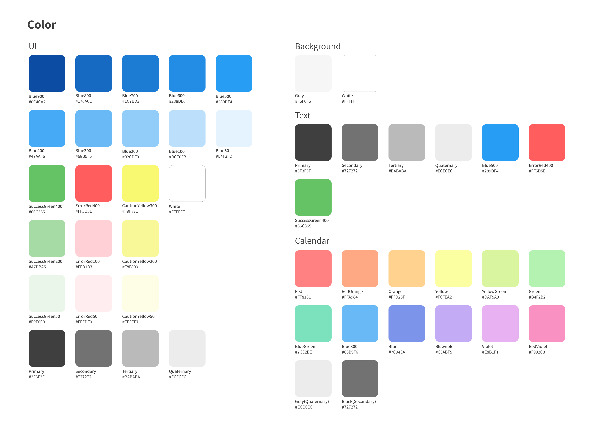
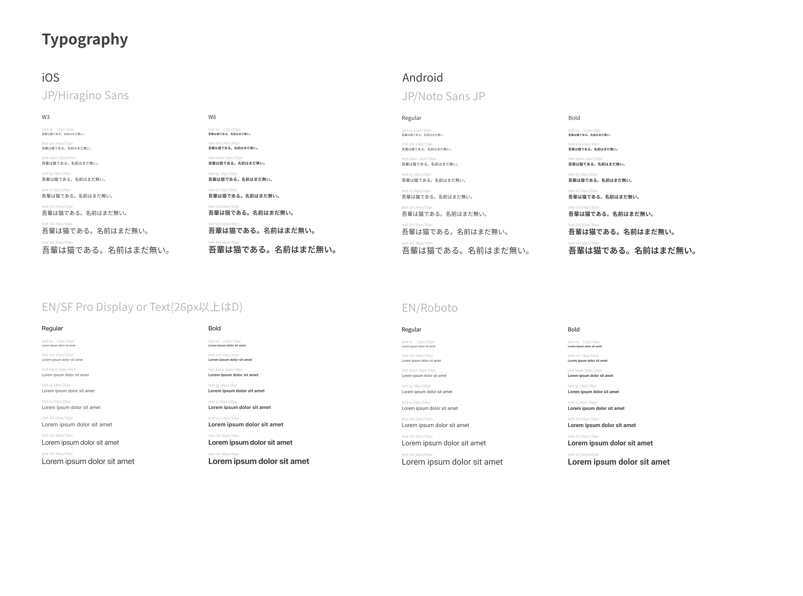
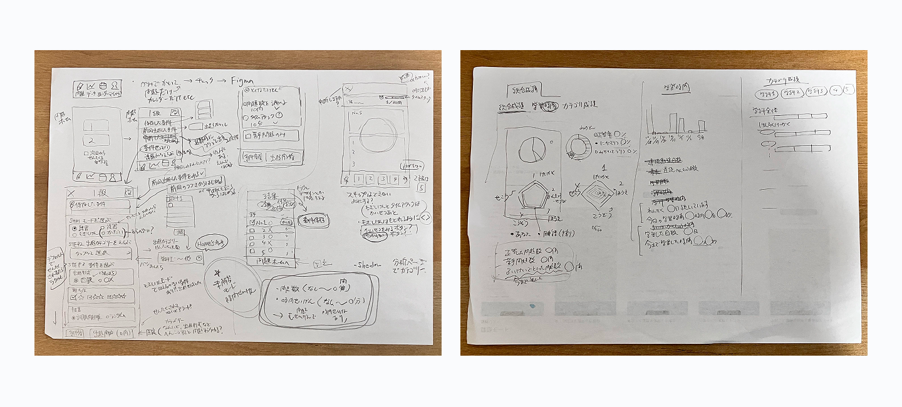
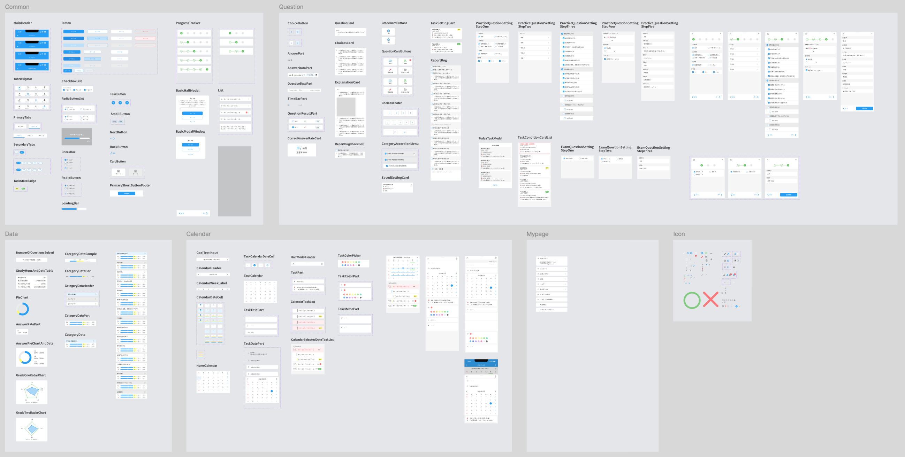
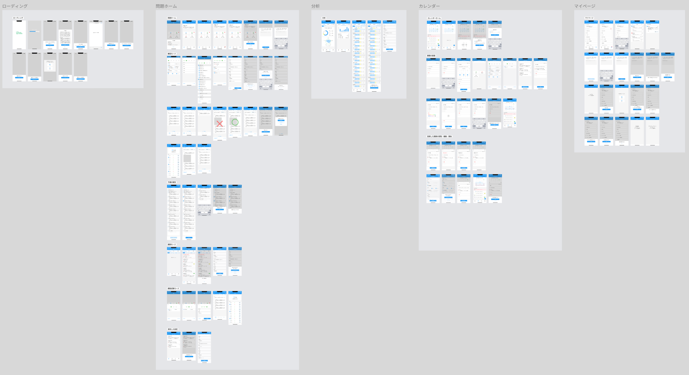
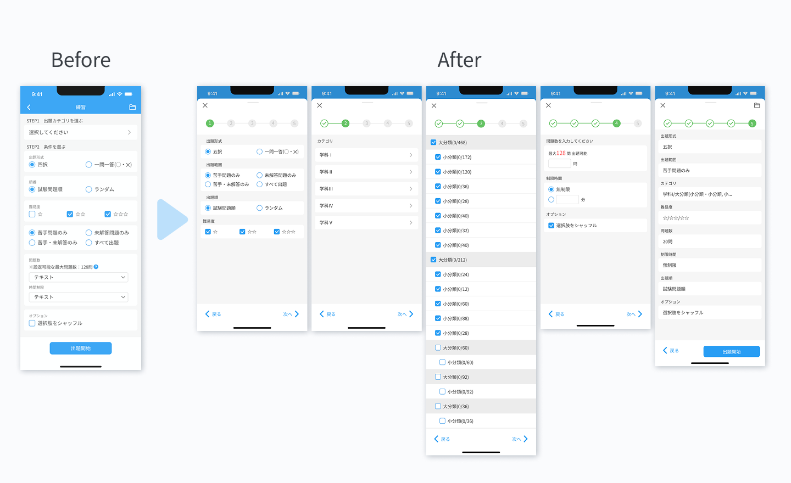
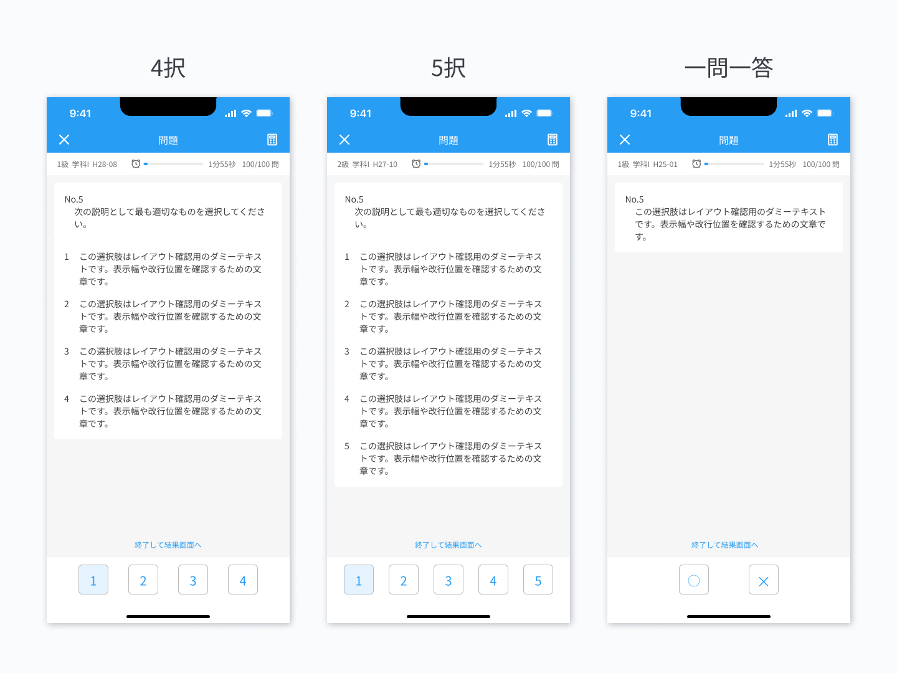
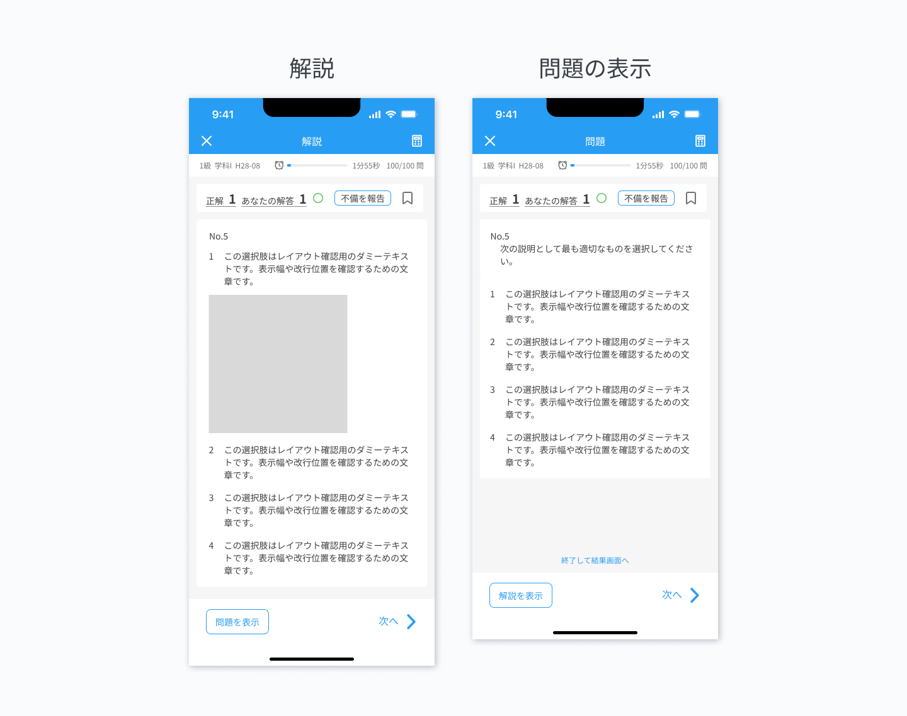
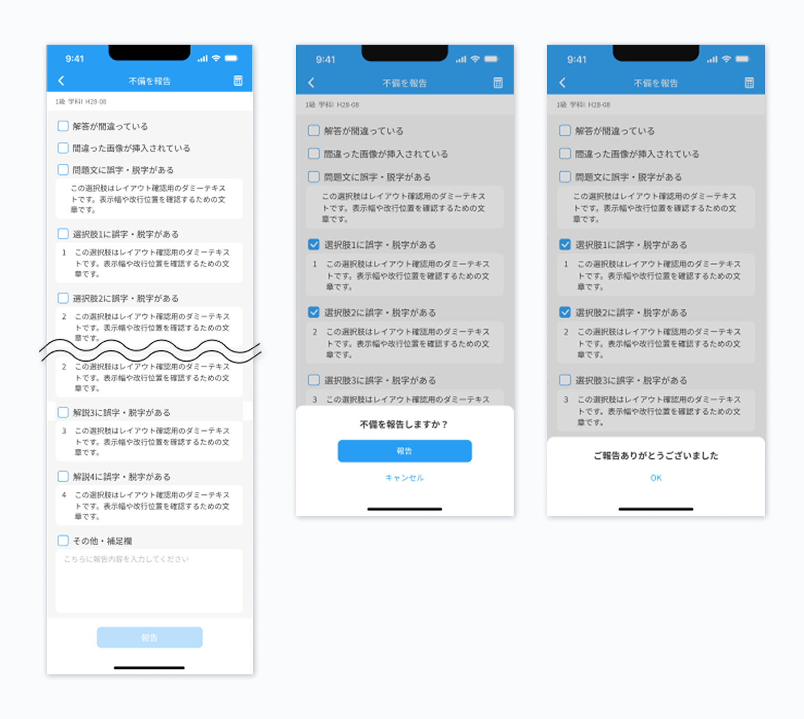
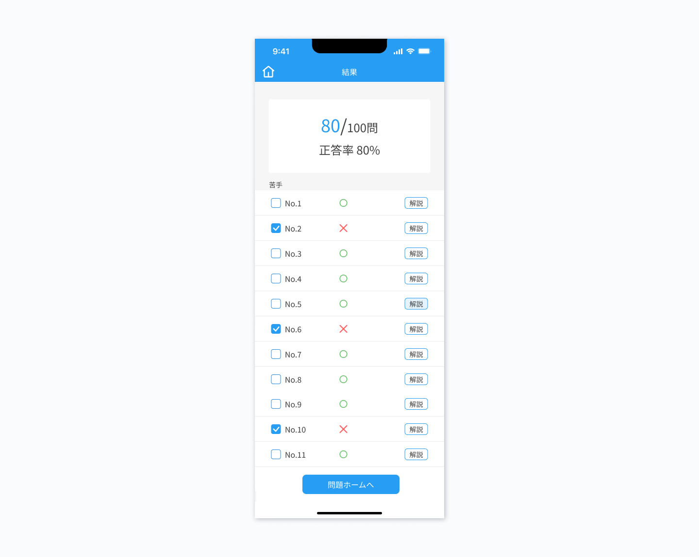

# gotoの担当・実績 | WorkbookApp

執筆者: goto

試験学習を支援するReact Nativeの問題集アプリ「WorkbookApp」を、2名で共同開発しました。このページでは、開発においてgotoが担当した内容と、デザイン・実装上の工夫を紹介します。

## 目次

- [概要](#概要)
  - [システムの概要](#システムの概要)
  - [担当範囲](#担当範囲)
  - [使用ツール](#使用ツール)
- [UIデザイン](#uiデザイン)
  - [スタイルガイドの作成](#スタイルガイドの作成)
  - [スケッチ](#スケッチ)
  - [コンポーネントライブラリの作成](#コンポーネントライブラリの作成)
  - [画面デザイン](#画面デザイン)
  - [デザインで工夫した点](#デザインで工夫した点)
  - [デザインの反省点](#デザインの反省点)
- [画面実装](#画面実装)
  - [実装で工夫した点](#実装で工夫した点)
  - [実装の反省点](#実装の反省点)
- [振り返り](#振り返り)

## 概要

### システムの概要

システム全体の概要およびプロダクトの設計・機能に関しては、以下のリンクをご参照ください。

[システム全体の概要](../../../../README.md)

[プロダクトの設計・機能](../../README.md)

### 担当範囲

- UIデザイン：スタイルガイド、コンポーネントライブラリの作成、主要画面の構成・操作の流れを設計
- フロントエンド設計の一部：UI関連ライブラリの調査・選定
- 画面実装：React NativeとTailwind CSSによるコンポーネント作成、主要画面の実装、useStateとContextを用いた状態管理、StorybookのStory作成

### 使用ツール

デザイン：Figma

コーディング：Visual Studio Code

## UIデザイン

学習に集中できるよう、シンプルで操作がわかりやすいデザインを目指して作成しました。

### スタイルガイドの作成

開発当時は、コーポレートカラーが策定されていなかったため、Webサイトで主に使用されていた色をメインカラーとして採用しました。

    
    

### スケッチ

共同開発者のaraiが作成した初期スケッチをもとに、画面遷移や操作方法を整理しながらデザインを具体化しました。

### コンポーネントライブラリの作成

ボタンやチェックボックスなどの基本コンポーネントは基本コンポーネントとして先に作成し、その他は画面をデザインしながら共通化できそうなものをコンポーネント化しました。

### 画面デザイン

問題、分析、カレンダー、マイページの各画面を作成・整理しました。

[Figma](https://www.figma.com/design/TNBTnlVuvSe3pIJiONM80h/WorkbookApp_%E3%83%9D%E3%83%BC%E3%83%88%E3%83%95%E3%82%A9%E3%83%AA%E3%82%AA%E7%94%A8?node-id=4905-40153&t=U2Mdt24xqsyxxvIk-1)

### デザインで工夫した点

ここでは問題タブの画面を中心に、デザイン上の工夫を紹介します。

#### 問題設定画面

- 当初は問題設定を一画面で完結させていたが、出題形式や難易度によって選択可能なカテゴリが変わるため、段階的に入力するステップ方式へ変更
- 同じ条件で繰り返し解けるよう、設定に名前をつけて保存し、問題ホームの「保存した設定」から呼び出せる機能を追加
- メインカラーの青色だけの単調な画面にならないように、プログレストラッカーに緑色を使用。一方で、当時アクセントカラーを定義していなかったため、感覚的に色を選んでいた点が課題

#### 出題画面

- 残りの問題をスキップして終了する場合は、問題文と解説文の下部にある「終了して結果画面へ」ボタンを、また学習データを保存して中断する場合は左上の「✕」ボタンから「保存して中断」をタップして終了できるように設計
- 現在解いている問題の級・学科・年度、タイマー、現在何問目を解いているかといったデータは、画面上部に小さめの文字で表示し、問題文の表示スペースを圧迫しないように調整
- タイマーは問題を解く際の妨げにならないように小さく表示

#### 解説画面

- 「正解」と「あなたの解答」の横に色のついた「〇」「✕」を表示することで、解答結果を一目で判断できるよう設計
- 解答後も問題文を確認できるように、「問題を表示」「解説を表示」ボタンを下部に配置し、問題と解説の切り替えられる構成に
- 問題の不備を解説画面からすぐに報告できるように、各問題の解説画面に「不備を報告」ボタンを配置

#### 不備報告画面

- 報告画面では、各チェックボックスの下に対象の問題文や解説文を表示。元の画面に戻って確認する手間を減らし、報告者がすぐ指摘できる構成に

#### 結果画面

- 正答数はわかりやすく大きめの文字で表示
- 間違えた問題の解説をすぐ確認できるよう、各問題の右側に「解説」ボタンを配置
- 正解した問題も、「苦手問題」として扱えるように、チェックボックスを配置

### デザインの反省点

FigmaでUIを時間をかけて作り込んでから実装に着手しましたが、早い段階で実装を始め、実際の画面で確認しながらデザインをブラッシュアップしていく方が効率的だと感じました。

## 画面実装

### 実装で工夫した点

#### **余白をレイアウト側で管理**

縦横の方向とサイズを指定できるSpacerコンポーネントを作成し、コンポーネント間の余白にmarginの代わりとして使用しました。これにより、余白を各コンポーネントのスタイルに依存させず、レイアウト側で管理できるようにしました。

#### **問題数と制限時間の入力チェック**

練習モードの出題設定の問題数と制限時間には、未入力、0以下、数値以外、出題可能数を超える値を判定するバリデーションを実装しました。エラーが出ている場合は赤字で表示し、次の画面へ進めないようにしました。

### 実装の反省点

#### コンポーネント分割の粒度

React Nativeを使ったコンポーネント開発が初めてだったため、適切な分割単位の判断が難しいと感じました。

例えばボタンを、色やサイズを指定せずに配置できるよう、PrimaryShortButton、PrimaryLongButton、SecondaryShortButton、SecondaryLongButtonとコンポーネントを分けて作成しました。呼び出し側の指定は簡潔になった一方でで似た構造のファイルが増え、共通部分を変更する場合に複数のファイルを修正する必要がありました。

今後は共通のボタンコンポーネントを作り、色やサイズをpropsで切り替えられる構成にしたいです。

#### Storybookの運用

コンポーネントの表示確認にStorybookを利用していました。Storybook8でモバイルUIの改善やパフォーマンスの向上などがあり、バージョンアップをすることになりました。記述方法が変わったことでコードを大幅に修正する必要ができましたが、修正作業の優先順位が上げられず、継続的な運用ができませんでした。

今回のように、二人での開発でリソースが限られている場合は、Figmaのコンポーネント管理と、画面上での確認のみでいいのではないかと思いました

今後Storybookを利用する際は、コンポーネントを修正するときにStoryも同時に更新するなど、メンテナンスを日々の開発に組み込みます。

## 振り返り

HTML、CSS、JavaScriptの基礎を学んだ段階から、React Native、TypeScript、Figmaなど初めて使うフレームワークや言語、ツールを使って開発を始めました。JSX記法や型などに慣れるまで時間がかかりましたが、学びながら手探りで開発を進めました。この経験から、わからない箇所を地道に調査し解決する進め方を身につけました。
