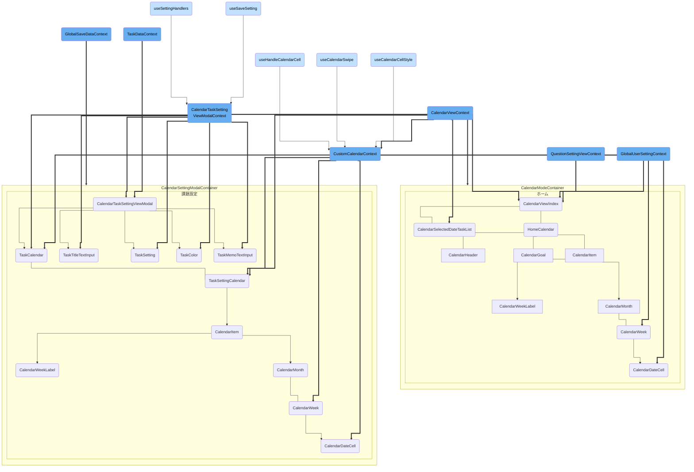

# カレンダーのデータフロー

```mermaid

%%{ init: { 'flowchart': { 'curve': 'stepAfter' } } }%%


flowchart TB;
    gsdc(GlobalSaveDataContext) 
    gsdc=========>CalendarSettingModalContainer
    
    gusc(GlobalUserSettingContext) 
    gusc===>cv(CalendarView/index)

    qsvc(QuestionSettingViewContext)
    qsvc===>cv

    tdc(TaskDataContext) 
    tdc=========>ctsmv

    ctsmv(CalendarTaskSettingViewModal)
 

    %% CalendarViewContext
    cvc(CalendarViewContext) 
    cvc===>ccc
    cvc===>csdtl
    cvc===>tsc

    %% CustomCalendarContext
    ccc(CustomCalendarContext)
    uccs(useCalendarCellStyle)------>ccc
    ucs(useCalendarSwipe)------>ccc
    uhcc(useHandleCalendarCell)------>ccc
    
    ccc=====>cw
    ccc=====>cdc

    ccc=====>tc
    ccc=====>tsc
    ccc=====>tcw
    ccc=====>tcdc

  

    %% CalendarTaskSettingViewModalContext
    ctsvmc(CalendarTaskSetting<br>ViewModalContext)
    uss(useSaveSetting)------>ctsvmc
    ush(useSettingHandlers)------>ctsvmc
    ctsvmc=====>ctsmv
    ctsvmc=====>CalendarModeContainer
    ctsvmc=====>cv

    ctsvmc=====>tt
    ctsvmc=====>tc
    ctsvmc=====>ts
    ctsvmc=====>tco
    ctsvmc=====>tm

    subgraph CalendarModeContainer
        subgraph ホーム
        cv---csdtl(CalendarSelectedDateTaskList)
        cv---hc(HomeCalendar)
        hc---CalendarHeader
        hc---CalendarGoal
        hc---CalendarItem
        CalendarItem--->CalendarWeekLabel
        CalendarItem--->CalendarMonth---cw(CalendarWeek)
        cw--->cdc(CalendarDateCell)

        end
    end

    subgraph CalendarSettingModalContainer
        subgraph 課題設定

        ctsmv--->tt(TaskTitleTextInput)
        ctsmv--->tc(TaskCalendar)

        ctsmv--->ts(TaskSetting)
        ctsmv--->tco(TaskColor)
        ctsmv--->tm(TaskMemoTextInput)

        tc---tsc(TaskSettingCalendar)--->tci(CalendarItem)
        tci--->tcwl(CalendarWeekLabel)
        tci--->tcm(CalendarMonth)---tcw(CalendarWeek)
        tcw--->tcdc(CalendarDateCell)
        
        end

        %%subgraph SelectQuestionMode
    
        %%end

        %%subgraph PracticeQuestionSetting
    
        %%end

        %%subgraph ExamQuestionSetting
    
        %%end

        %%subgraph SavedSetting
    
        %%end

    end


style gsdc color:black,fill:#67aef0
style gusc color:black,fill:#67aef0
style qsvc color:black,fill:#67aef0
style tdc color:black,fill:#67aef0
style cvc color:black,fill:#67aef0
style ccc color:black,fill:#67aef0
style ctsvmc color:black,fill:#67aef0


style uccs color:black,fill:#c2e1ff
style ucs color:black,fill:#c2e1ff
style uhcc color:black,fill:#c2e1ff

style uss color:black,fill:#c2e1ff
style ush color:black,fill:#c2e1ff


```