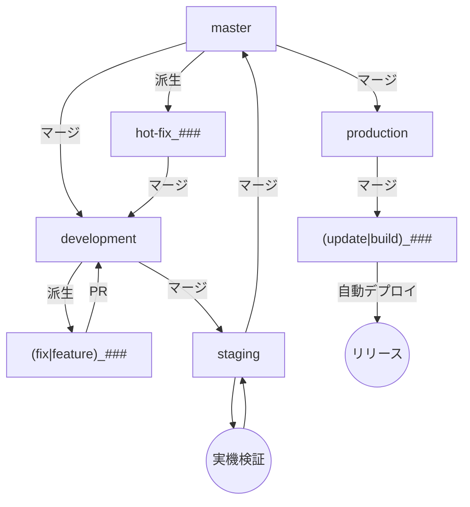
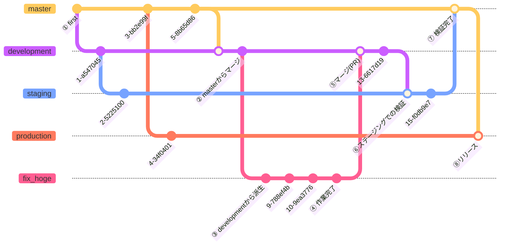

# デモ専門学校アプリgitルール

基本的にGit Flowの考え方に基づいたルールを設定する

[https://zenn.dev/hankei6km/articles/mermaid-gitgraph-diagrams](https://zenn.dev/hankei6km/articles/mermaid-gitgraph-diagrams#%E3%82%B3%E3%83%9F%E3%83%83%E3%83%88%E3%81%AE%E3%83%A9%E3%83%99%E3%83%AB%E3%82%92%E8%A6%8B%E3%82%84%E3%81%99%E3%81%8F%E3%81%97%E3%81%9F%E3%81%84)

環境

- development

開発用環境。firebaseプロジェクトはステージングとは別途用意。

基本的に開発はこの環境を利用して行う。

dev-clientは提供するが実機テストは不可。

expo-updateは非対応。

- staging

本番に近い環境。developmentで開発したフロントエンドの機能をここで最終テストするための環境。クライアントはdev-client/実機テスト両方で可能

expo-updateでの変更も対応する。

- production

いわゆる本番環境。

| 環境修飾子 | simulator | 実機 | expo-update | 説明 |
| --- | --- | --- | --- | --- |
| development | ◯ | × | × | 開発用環境 |
| staging | × | ◯ | ◯ | 本番環境に近い環境 |
| production | × | ◯ | ◯ | 本番環境 |

[https://www-creators.com/archives/780](https://www-creators.com/archives/780#i-6)

## 基本的な作業フロー

master→development→実作業ブランチ→staging→master→production(リリース)

という順に作業を進める

### 図1 フローチャート

図2 機能修正時の想定コミットツリー

## リモートブランチ

[https://gizumo-inc.jp/media/git-operation/](https://gizumo-inc.jp/media/git-operation/)を参考に策定

なお便宜上、releaseブランチはstagingブランチという名前に読み替えてください

### 作業親ブランチ

- master

実際に稼働しているサービスと同等のコード

production_*ブランチは必ずmasterからのみマージまたはリベースする

masterへのマージは必ずstagingからのみ経由する

**直接の作業は行わない**

派生ブランチ:development・production・hotfix

- development

masterから派生する作業用ブランチ。基本的にここへPRを送ることでマージする

ここからfix(bugFix)・feautureを派生させる

派生子ブランチ:fix・feature・hotFix・build・(bugFix)

- staging

実機検証用の環境。原則としてdevelopmentからのみ派生する

基本的に作成後は追加機能を取り込まず、バグがあればstagingブランチおよびその子ブランチで解決する

検証終了後はmasterへマージする(原則としてmasterへのマージはstagingからのみ)

マージ後はstagingブランチを削除する

派生子ブランチ:fix・build・update

- production

リリース用ブランチ。masterから派生する

ここからbuild_production・update_productionへマージすることでリリースする

### 作業子ブランチ

作業親ブランチから派生するブランチ。原則として、**直系の親と兄弟ブランチからのみ**マージを許す(ただし並行作業中にmasterが変更された場合にどうしてもmasterをプルする必要がある場合などはその限りではない)。

- feature_{作業No}

機能開発用ブランチ

完了後はdevelopmentにPRしてマージ

*PR通過後は基本的にリモートブランチは削除される

- fix_{作業No}

バグ修正用ブランチ

完了後はdevelopmentにPRしてマージ

*PR通過後は基本的にリモートブランチは削除される

*旧名のbugFixと同じ。今後はfix_で統一

- development_build_(ios|and)

親ブランチ:development

- (development|staging|production)_**build**_(ios|and)

このブランチがプッシュされると自動的にiosまたはandroid向けのEASビルドが自動的に走る

developmentで新しいパッケージを導入したい場合はnpm install後にこのブランチをプッシュすると自動的にEAS Buildが走る

EAS Buildが終了後はExpoにログインしてapkやtar.gzをダウンロードしてシミュレータにインストールすることでテストが可能

productionおよびstagingをiosでビルドした場合は自動でAppStoreConnectに登録される(コンプライアンスの確認やリリース作業は手動でやる必要がある)。

なお一回あたり1ドル〜2ドルの費用負担が発生するので、**絶対にこのブランチで作業しない**

参考:

https://docs.expo.dev/build/building-on-ci/

- (staging|production)_**update**_(ios|and)

このブランチがプッシュされると自動でExpo Updateへの登録フローが走りUpdateが配布される

なお、Updateの際にapp.config.tsは手動で調整する必要がある

参考:

https://docs.expo.dev/eas-update/github-actions/