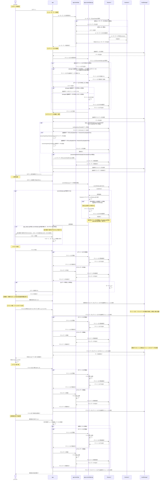

# ユーザーデータ同期のシーケンス図

```mermaid

sequenceDiagram
  actor  ユーザー
  participant app as app
  participant app_userData as app:UserData
  participant app_dailyLog as app:currentDailyLog
  participant firestore as firestore:*
  participant functions as functions:*
  participant storage as localStorage:* 
  

%% ログイン時処理(ローディング画面)
　Note over ユーザー:1.ログイン時処理
  ユーザー ->>+ app: ログイン

  Note over app:1-1.ユーザーデータ取得
  app ->>+ app_userData: ユーザーデータの取得命令
  app_userData ->>+ firestore: ユーザーデータ(UserData)を要求
　 alt 該当ユーザーデータが存在する場合
  　firestore ->>- app_userData: ユーザーデータを返す
  else 存在しない場合
    firestore -->> app_userData: エラーを返す
    app_userData ->>+ functions: ユーザーデータの作成要求
    functions ->>+ firestore: ユーザーデータ作成(functions)
    firestore -->>- functions: 作成完了
    functions -->>- app_userData:作成されたユーザーデータを返す
　end
　app_userData -->>- app:ユーザーデータ取得完了

  Note over app:1-2.デイリーログの取得
  app ->>+ storage: 退避用データの取得
  storage -->>- app: データを返す
  app ->>+ app_dailyLog: デイリーログの取得命令
  app_dailyLog ->>+ firestore: デイリーログ(currentDailyLog)を要求
  alt 該当のデイリーログが存在する場合
   firestore -->> app: デイリーログを返す
   opt storageに退避用データが存在し、かつ取得したデイリーログより更新日付が後の場合
    app -->> app_dailyLog: デイリーログを退避用データで更新する
    app_dailyLog -->>+ firestore: デイリーログを更新する
    firestore -->>- app_dailyLog: デイリーログ更新完了通知
   end
  else デイリーログが存在しない場合
   app_dailyLog -->> app: エラーを返す
   alt storageに退避用データが存在した場合
    app -->> app_dailyLog:退避用データをデイリーログにする
   else storageに退避用データが存在しなかった場合
    app_dailyLog ->> app_dailyLog: デイリーログを作成
   end
   app_dailyLog ->> firestore: デイリーログの作成要求
   firestore -->>- app_dailyLog: デイリーログを返す
  end
  app_dailyLog ->> app:デイリーログ保存
  
  Note over app:1-3.テストデータの確認・取得
  app ->>+ storage: 退避用テストデータの取得
  storage -->>- app: データを返す
  opt app_userDataのdailyLog.currentTestIdが<br>null or undefinedでない場合
    app ->>+ firestore: testDataStore/{TestId}のデータ照会
    firestore -->>- app: テストデータまたはエラーを返す
    alt 退避用データのLastUpdateTime <= firestoreのLastUpdateTime
     app -> app:answerlingSettingTestDataにfirestoreテストデータを設定
    else 退避用データのLastUpdateTime > firestoreのLastUpdateTime
     app -> app:answerlingSettingTestDataに退避用データを設定
     app ->>+ firestore:テストデータを更新
     firestore -->>- app:更新完了
    end
    opt answerlingSettindTestDataのisFinishedがtrueの場合
     app -> app_userData: ユーザーデータのcurrentTestIdをnullに更新
     app_userData ->>+ firestore: ユーザーデータ更新要求
     firestore ->>- app_userData: ユーザーデータ更新完了
    end
  app ->>+ storage: 退避用テストデータを削除
  storage -->>- app: 退避用テストデータ削除完了
 end
  app ->>- ユーザー: ログイン成功通知(サイレント)

%% 2.常時処理
　Note over ユーザー:2.常時処理
　ユーザー ->> app: ログイン処理完了後(1のあと)
  app ->> app_dailyLog: currentDailyLogとデータ同期を開始
　app_dailyLog ->> firestore: currentDailyLogをListen
　firestore -->> app_dailyLog: established
　opt currentDailyLogが変更される
  　firestore ->>+ app_dailyLog: 変更通知
    app_dailyLog ->> app_dailyLog: firestoreとクライアントのdailyLogを比較
    opt 日付処理による変更だった場合<br>(appliedフラグがtrue)
     Note over app_dailyLog: dailyLogを新たに作成する
      app_dailyLog ->> app_dailyLog: デイリーログを作成
      app_dailyLog ->>+ firestore: デイリーログの作成要求
      firestore -->>- app_dailyLog: 作成完了
    end
    Note over app_dailyLog,firestore:基本的にプレイ中は取得したfs:dailyLogの値は<br>app:dailyLogの値と一致する
    app_dailyLog ->>+ app:変更通知
    alt app_dailyLogの値とcurrentDailyLogの値が異なり、かつテスト中の場合
     Note over app: 他の端末で操作が行われたと判定する
     app ->>+ ユーザー: 他の端末で操作が行われたため、リロードする旨を伝えるモーダルを表示
     ユーザー ->>- app: リロード承認
     app ->>- app: リロード。ローディング画面に戻る
    end
  end

%% 3.テスト作成
  Note over ユーザー:3.テスト作成

  ユーザー ->>+ app: テスト作成
  par デイリーログの更新
   app ->>+ app_dailyLog: デイリーログ更新
   app_dailyLog ->>+ firestore: デイリーログ更新要求
   firestore -->>- app_dailyLog: デイリーログを返す
   app_dailyLog -->>- app:デイリーログ更新完了
  and テストデータ作成
   app ->>+ app_userData:テストデータ作成
   app_userData ->>+ firestore:テストデータ作成要求
   firestore -->>- app_userData:テストデータを返す
   app_userData -->>- app:テストデータ作成完了
  end
  opt [エラーが発生した場合]
   firestore ->> firestore: ロールバック
   app ->> ユーザー: エラーを通知する
  end
  app -->>- ユーザー:テスト作成完了
%% 4.問題を一問解きおわった後の処理
  Note over ユーザー:4.問題を一問解きおわった後の処理(最終問題は除く)
  ユーザー -) app:問題を解きおわった
  app -) storage:更新後のテストデータとデイリーログを退避用ストレージに保存

%% 5.テスト中断またはテスト中アプリ終了
  Note over ユーザー:5.テスト中断・テスト中アプリ終了
  ユーザー ->>+ app: テストを中断またはテスト中アプリ終了しようとする
  Note over storage:デイリーログ・テストデータの更新が失敗した場合に備え退避
  app -) storage:テストデータとデイリーログを退避用ストレージに保存
  par デイリーログ更新
   app ->>+ app_dailyLog:デイリーログ更新
   app_dailyLog ->>+ firestore: デイリーログ更新要求
   firestore -->>- app_dailyLog: デイリーログを返す
   app_dailyLog -->- app:デイリーログ更新完了
  and テストデータ更新
   app ->>+ app_userData:テストデータ更新
   app_userData ->>+ firestore:テストデータ更新要求
   firestore -->>- app_userData:テストデータを返す
   app_userData -->>- app:テストデータ更新完了
  end
  Note over storage:更新がうまくいった場合はストレージからデータを削除
  app ->>+ storage:テストデータとデイリーログをストレージから削除
  storage -->>- app:データ削除完了
  app -->>- ユーザー:中断またはアプリ終了処理続行
  ユーザー ->> ユーザー:中断またはアプリ終了


%% 5.テスト終了時
  Note over ユーザー:6.テスト終了時
  ユーザー ->>+ app:テストを全て解きおわった
  par デイリーログ更新
   app ->>+ app_dailyLog:デイリーログ更新
   app_dailyLog ->> app_dailyLog:テスト終了処理
   app_dailyLog ->>+ firestore: デイリーログ更新要求
   firestore -->>- app_dailyLog: デイリーログを返す
   app_dailyLog -->>- app:デイリーログ更新完了
  and テストデータ更新  
   app ->>+ app_userData:テストデータ更新
   app_userData ->> app_userData:テスト終了処理
   app_userData ->>+ firestore:テストデータ更新要求
   firestore -->>- app_userData:テストデータを返す
   app_userData -->>- app:テストデータ更新完了
  end
   app -) storage:テストデータとデイリーログを退避用ストレージに保存
   app -->>- ユーザー:テスト終了時保存処理完了

%% 6.解説表示終了後処理
  Note over ユーザー:6.解説表示終了後処理
  ユーザー ->>+ app:解説表示を終了した
  app ->> app:苦手問題チェックを変更しているか確認
  opt 変更していた場合
   par デイリーログ更新
    app ->>+ app_dailyLog:デイリーログ更新
    app_dailyLog ->> app_dailyLog:テスト終了処理
    app_dailyLog ->>+ firestore: デイリーログ更新要求
    firestore -->>- app_dailyLog: デイリーログを返す
    app_dailyLog -->>- app:デイリーログ更新完了
   and テストデータ更新  
    app ->>+ app_userData:テストデータ更新
    app_userData ->> app_userData:テスト終了処理
    app_userData ->>+ firestore:テストデータ更新要求
    firestore -->>- app_userData:テストデータを返す
    app_userData -->>- app:テストデータ更新完了
   end
  end
   app -) storage:テストデータとデイリーログを退避用ストレージから削除
   app -->>- ユーザー:解説表示後処理終了


   

```

